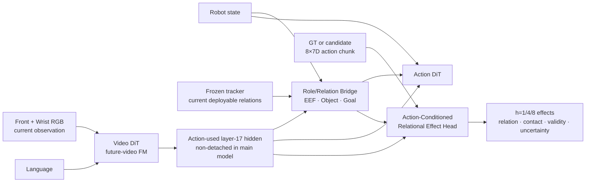
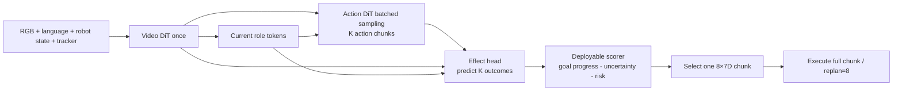

# Object-Centric WAM 三方案复审、Novelty 判断与最快实现建议

首次完成：2026-07-24 03:29:29 UTC  
FlowWAM 对照修订：2026-07-24 UTC

复审对象：

```text
docs/OBJECT_CENTRIC_WAM_THREE_FEASIBLE_DESIGNS_CN_20260724.md
```

本文重新检查 GOViT、RIFT-WAM、CARE-WAM 三个方案的科学逻辑、当前工程可行性、实现难度、新颖度和成为代表作的潜力。判断依据不是方案图本身，而是：

1. 当前 DiT4DiT/Cosmos 代码的真实梯度与张量接口；
2. 已完成的 ManiSkill EORT v3 数据、tracker 和闭环结果；
3. 本地 X-WAM 的实际代码/权重状态；
4. 截至 2026-07-24 可检索到的相关工作。

这是一份设计复审文档，没有修改模型、训练脚本、数据或已有实验产物。

实施级方案以
[`docs/COE_WAM_RELIABLE_IMPLEMENTATION_PLAN_CN_20260724.md`](COE_WAM_RELIABLE_IMPLEMENTATION_PLAN_CN_20260724.md)
为准。后续代码审计进一步发现：旧稿以 `Δee_to_object + Δobject_to_goal` 作为 primary
effect 会混入 EEF 自身运动学，而且静态 goal 下后者与 object displacement 重复。
因此第一版已修订为直接预测 `object_delta_pos_base` 与 contact/grasp event；
relation 只作 current context、派生 scorer 和诊断。uncertainty 也推迟到
deterministic effect 与 candidate ranking 通过之后。

---

## 0. 最终结论

### 0.1 三个方向都合理，但原来的实施优先级需要调整

原文建议：

```text
先 GOViT
→ 再 RIFT
→ 最后 CARE
```

复审后的建议：

```text
保留现有 tracker-flat DiT4DiT 基线
→ 先验证 action-conditioned relational effect
→ 用 ManiSkill 同状态、多动作 branch 监督消除 expert-intent 混淆
→ 利用现有随机 Action DiT 批量产生 K 个 action chunk
→ effect model 预测每个候选动作的 object effect 并选择
→ 只有该因果 gate 成立后，再增加更完整的 Video hidden role grounding
```

核心变化是：

> 不先做完整 GOViT，也不先做一个仅观察条件的 RIFT。最快且更有论文价值的路线，是先把当前已有的 dynamics head 改造成“读取 candidate action、接受同状态反事实监督”的 relational effect bridge。

这可以暂称：

> **COE-WAM：Counterfactual Object-Effect WAM**

`Causal-RIFT` 保留为前一版内部代号，不再建议作为论文主名称。原因是
“flow”同时可能指 flow matching、optical flow 和关系状态轨迹；在
[FlowWAM](https://arxiv.org/html/2607.13017) 已明确使用 optical flow 作为
WAM 动作表示后，继续以 RIFT/flow 命名会制造不必要的概念重叠。论文真正要验证的
不是一种新的 flow，而是 **candidate action 所造成的 task-object effect**。

### 0.2 为什么推荐 COE-WAM

它抓住了当前三个方案中最有区分度的部分：

```text
不是“看见 object”
而是“在同一个当前状态下，区分不同 action 将怎样改变 object”
```

这比单独增加 mask、keypoint、role token 或 future-object head 更接近 world model 的核心定义：

```text
p(future world | current world, action)
```

而不是当前 observation-only dynamics 实际学习的：

```text
p(expert future | current observation, instruction)
```

### 0.3 评分总表

评分是当前项目条件下的相对研究判断，不代表论文录用概率。`实现容易度` 越高表示越容易。

| 方案 | 科学合理性 | 当前工程可靠性 | 实现容易度 | 单独 novelty | 补齐实验后的代表作潜力 |
| --- | ---: | ---: | ---: | ---: | ---: |
| GOViT | 4/5 | 3/5 | 2.5/5 | 2/5 | 2.5/5 |
| RIFT-WAM（不读 action） | 4.5/5 | 3.5/5 | 3/5 | 3/5 | 3.5/5 |
| CARE-WAM（原 draft-refine） | 4.5/5 | 2/5 | 1.5/5 | 4/5 | 4/5 |
| COE-WAM（原内部代号 Causal-RIFT） | 4.5/5 | 3/5 | 2.5/5 | 4/5 | 4.5/5 |

这里有一个必须强调的边界：

> 只在 PushCube/PickCube 上增加任何一个 head，都不足以成为代表作。

架构只是必要条件。代表作还需要：

- 同状态反事实数据或其他能够识别 action effect 的强监督；
- 多任务、多物体、遮挡和 distractor；
- 相机、纹理、几何、物理与 action-delay OOD；
- 至少一部分真实相机/真实机器人证据；
- 完整因果消融、失败分析、可视化和计算代价报告。

### 0.4 与 FlowWAM 对照后的修订结论

这里必须先拆开三个完全不同的“flow”：

| 名称 | 含义 | 典型 shape | 是否直接表达 task-object effect |
| --- | --- | --- | --- |
| flow matching | 从噪声到数据的生成训练目标/速度场 | 与被生成 latent 相同 | 否 |
| optical flow | 相邻图像像素的二维位移 | `(T,H,W,2)`，也可编码为 RGB/HSV | 只表达可见像素运动，不保证 |
| 本文旧称 interaction flow | EEF/object/goal 在多个 horizon 的关系变化 | 稀疏 metric 3D relation/effect | 目标是表达，但不应再叫 flow |

因此，“我们也转到 flow”如果只是指继续用 flow matching，和 object-centric
没有冲突；如果是指把中间表示改成 optical flow，则会明显靠近 FlowWAM，不应作为
本文主路线。

对当前项目的修订判断是：

1. **object-centric condition 仍有意义，但不能把现有 17D flat condition
   本身当成主要贡献。**
2. optical flow 回答“图像中哪些可见像素怎样移动”；object condition 应回答
   “哪个是任务 object/goal、它们在 robot-base metric 3D 中在哪里、当前观测
   是否可靠”。
3. 更重要的新模块应回答“给定这个 candidate action，task object 将产生什么
   可验证的关系变化”，也就是 object effect，而不是再预测一份稠密像素 flow。
4. FlowWAM 在 RoboTwin 中使用的目标尤其是 **robot-only optical flow**：
   通过静态背景重放机器人轨迹后估计光流，以尽量排除物体运动、背景变化和光照
   伪影；wrist 的 robot-only flow 不可得时还使用常量占位。因此它更接近
   embodiment/robot-motion action representation，并没有替代 task-object
   effect。
5. 如果我们最终也做“RGB+稠密光流双流生成，再从光流解码动作”，与 FlowWAM 的
   核心差异就不够大。optical flow 只能作为 baseline、辅助监督或信息量消融，
   不能成为主贡献。

更准确的一句话是：

> **Pixel motion is not object effect. Successful manipulation requires identifying
> how a candidate action changes task-grounded objects, not merely predicting how
> visible pixels or the robot move.**

中文：

> 像素运动不等于物体效应。操作策略需要识别候选动作将如何改变任务语义对象，
> 而不只是预测可见像素或机器人怎样运动。

---

## 1. 当前项目已经有什么

## 1.1 当前 DiT4DiT 主链

当前已经训练并评估的最小改动版为：

```text
Front RGB 256×256 ─resize─> 224×224
Wrist RGB 256×256 ─resize─> 224×224
                     │
                     └─ 横向拼接为每帧 (3,224,448)

像素帧：
    [t0,t2,t4,t6,t8]
    t0 为条件帧
    后四帧提供 future-video flow-matching 监督

当前 robot state：
    8D → sin/cos → 16D

frozen learned tracker：
    17D object message + 1D valid

Action DiT state：
    16 + 17 + 1 = 34D
    → 原 state encoder
    → 一个 state token

Video DiT：
    当前帧 + language
    → fixed-layer predictive hidden

Action DiT：
    Video hidden + state token + noisy action tokens
    → 8×7D robot-base metric action chunk
```

当前训练：

- Video DiT 与 Action DiT 全参数训练；
- text encoder 和 VAE 冻结；
- future-video flow-matching loss 开启；
- tracker 离线训练、冻结并提前导出；
- 只使用 front+wrist，不使用 right-shoulder；
- PushCube/PickCube 50/50 联合采样。

## 1.2 当前已经取得的闭环证据

20k checkpoint 的正式协议为：

```text
test seeds:       2000000..2000049
replan_every:     8
max_steps:        200
Action DDIM:      10 steps
```

结果：

| 任务 | 成功率 | tracker-valid | 平均步数 | action clipping |
| --- | ---: | ---: | ---: | ---: |
| PushCube | 49/50 = 98% | 1.0000 | 92.94 | 0 |
| PickCube | 41/50 = 82% | 0.9069 | 122.68 | 0 |

146 个 held-out open-loop 样本：

```text
first-action arm L2 = 0.005925
chunk arm L2        = 0.007187
Push chunk L2       = 0.004164
Pick chunk L2       = 0.009613
```

Push 前十条 test episode 的 tracker 诊断：

```text
EEF→object 平均误差  = 2.69 cm
object→goal 平均误差 = 4.00 cm
```

这些结果说明：

1. 当前数据、tracker、robot-base action、模型 server、仿真 client 和 8-step chunk 已经连通；
2. 现有 baseline 很强，尤其 Push 已接近饱和；
3. 新方案不能只报告 Push ID success；
4. Pick、遮挡、tracker invalid 和 OOD 才有更大的判别力；
5. Action DiT 从 `torch.randn` 开始采样，同一 simulator seed 重跑并不严格确定。

## 1.3 ManiSkill 当前可提供的监督

当前 v3 原始/派生数据已经有：

| 数据 | 当前用途 | 新方案可用性 |
| --- | --- | --- |
| front/right/wrist RGB-D 256×256 | policy/tracker/QA | 可用于多视角 grounding |
| 每帧 segmentation | 训练标签与 QA | 可生成 object/goal role mask |
| object/goal actor ID | 找到对应 mask | 只能作标签索引，不能作模型输入 |
| bbox、centroid、visibility | tracker 监督 | 可监督 role head |
| TCP/object/goal pose | robot-base relation | 可监督 current/future relation |
| camera intrinsic/extrinsic | 2D↔3D | 可做跨视角一致性 |
| h=1/4/8 future object motion | dynamics target | 可复用为第一版 effect target |
| robot-object contact | interaction label | 可监督 contact head |
| 8×7D metric action | Action DiT | 可作为 effect conditioning |
| actors/articulations env state | replay provenance | 是 counterfactual branch 的候选入口 |

当前 learned-tracker policy 数据默认没有把 future truth 暴露为 policy 输入。已有 exporter 能选择性生成 auxiliary future-target view，但 counterfactual branch 仍需要新建独立 sidecar 或数据视图。

## 1.4 现有 tracker 能做什么，不能做什么

当前 tracker 内部输出：

```text
RGB-D (B,4,256,256)
→ object/goal heatmap (B,2,128,128)
→ object/goal visibility logits (B,2)
```

随后通过 depth、intrinsic、extrinsic 回投为 robot-base 三维点，最终填入：

```text
17D condition + 1D valid
```

learned 路径实际可靠提供的是：

- `ee_to_object.xyz`；
- `object_to_goal.xyz`；
- object confidence；
- joint valid。

当前单帧 tracker 没有可靠提供：

- object orientation；
- linear/angular velocity；
- contact force；
- 遮挡后的 track memory；
- object/goal 分离 validity。

因此新 effect model 不应把 oracle 17D 的所有字段都当成真实可部署输入。

---

## 2. 原方案中必须修正的四个代码事实

这四点会直接改变实现难度和推荐顺序。

## 2.1 `detach_hidden=false` 当前不能让 Action loss 回传到 Video DiT

当前 `Cosmos25.py` 的 fixed-layer forward hook 无条件执行：

```python
self._cached_hidden.append(out.detach())
```

后面的 `detach` 参数只能再次 detach 已经被 hook 切断的 tensor，不能恢复计算图。

所以当前真实梯度关系是：

```text
future-video loss ──────────────> Video DiT

Action loss ─> Action DiT
            X
            └─不能通过 captured hidden 回到 Video DiT
```

原文中“先 `detach_hidden=true`，随后设为 false 做端到端消融”的描述不完整。若希望 role/effect/action loss 改造 Video DiT hidden，必须首先修改 hidden capture 合同：

```text
训练时可选 non-detached capture
推理/诊断时仍允许 detached capture
```

并用梯度断言验证 selected Video DiT block 确实得到非零梯度。

## 2.2 role token 不能直接追加到当前 Cosmos prompt embedding

当前 Cosmos checkpoint：

```text
crossattn_proj_in_channels      = 100352
encoder_hidden_states_channels = 1024
use_crossattn_projection       = true
```

当前文本接口把 text encoder 多层 hidden 归一化后沿最后一维拼接，形成 `100352D` prompt embedding，随后才由 transformer 内的 `crossattn_proj` 映射到 `1024D`。

因此原文提出的：

```text
concat(language_tokens, Dv-dimensional role tokens)
```

在当前接口上维度不成立。要实现必须选择：

1. 在 `crossattn_proj` 后注入 role token；
2. 给 role token 单独做 `100352D` adapter；
3. 改 transformer wrapper；
4. 不往 Video prompt 注入，改为从 Video hidden 用 role query 读取。

从可靠性和最小改动看，第 4 种最稳。完整 GOViT 若坚持让 role 反向条件化 Video DiT，则应使用明确的 adapter/residual，而不是直接拼 prompt。

## 2.3 Video hidden token layout 不是完全未知

当前 installed Cosmos transformer 明确执行：

```text
[B,T,H,W,C] → flatten(1,3) → [B,T×H×W,C]
```

因此顺序是可确定的 `T-H-W`，不是完全不可恢复。

按当前 front+wrist 配置可推导：

```text
像素视频                  5 × 224 × 448
VAE temporal scale        4
VAE spatial scale         8
transformer patch         1 × 2 × 2

latent time               (5-1)/4+1 = 2
latent spatial            28 × 56
patch-token spatial       14 × 28
nominal token count       2 × 14 × 28 = 784
hidden width              16 heads × 128 = 2048
```

但实现仍不应在新 head 中写死 `2×14×28`。backbone 应显式返回：

```text
(T_latent, H_patch, W_patch)
view boundary
pixel/latent time mapping
```

原文关于“token layout 风险”的结论仍成立，但风险应改写为：

> layout 本身可恢复，缺少的是稳定公开的 runtime metadata 与跨视角边界合同。

## 2.4 Action DiT 使用的 hidden 与 future-video FM 监督不是同一次 transformer call

当前实现：

1. 从视频推理式 denoising 的第一次 transformer call 捕获 hidden；
2. Action DiT 使用这个 hidden；
3. future-video flow-matching loss 随后构造独立的随机 flow time；
4. 再执行一次 transformer call 计算 video FM loss。

因此：

```text
Action DiT consume 的 hidden
≠
future-video FM 那次 forward 的 hidden
```

这不一定是 bug，但新 role/effect head 必须明确接在哪个表示上。

本文建议：

> 第一版 role/effect bridge 接到 Action DiT 真正消费的第一次 hidden；否则 auxiliary loss 学到的表示和控制使用的表示可能错位。

---

## 3. 方案一 GOViT 复审

## 3.1 核心假设

GOViT 的假设是：

> 全图 future-video loss 被背景主导；显式告诉 Video DiT 哪些 object/goal/EEF 区域与任务有关，可以产生更适合 Action DiT 的 predictive hidden。

这个假设是合理的。当前 cube 在整张 `224×448` 图像中的占比很小，整帧 MSE/flow loss 确实可能主要优化静态桌面和背景。

## 3.2 可靠性

有利条件：

- object/goal mask、centroid、visibility 已有；
- front/wrist 都有相机标定；
- simulator privileged label 可以只作监督；
- role mask 和 role token 可视化直观。

不利条件：

- 当前 prompt token 追加方案维度不成立；
- hidden hook 无条件 detach；
- VAE 时间压缩后只有两个 latent time slot，不能把五个像素帧直接当成五组 hidden；
- 当前 raw 没有持久化“仅两根手指”的独立 gripper mask；
- front/wrist 横向拼接中间有非自然图像接缝；
- 两个任务内 language 基本恒定，模型可以完全忽略语言也完成 grounding。

因此 GOViT 的工程风险应从原文的“低”上调为“中”。

## 3.3 实现难度

有两个不同版本：

### 版本 A：辅助 role head

```text
Video hidden
→ object/goal/EEF queries
→ mask/centroid/visibility loss
→ role tokens 给 Action DiT
```

这是中等难度，也是最稳的实现。

### 版本 B：真正条件化 Video DiT

```text
current visual role representation
→ 注入 Video DiT block
→ 改变 future-video denoising
→ object-weighted latent flow loss
```

这才是原文严格意义上的 GOViT，但需要处理 cross-attention 注入、latent mask 对齐、non-detached hidden 和多视角边界，难度明显更高。

## 3.4 Novelty 判断

GOViT 单独的新颖度偏低，原因是以下内容已有直接先例：

- grounding mask 指导 manipulation policy：[RoboGround](https://arxiv.org/abs/2504.21530)；
- object-centric latent future prediction：[Object-Centric World Model for Language-Guided Manipulation](https://arxiv.org/abs/2503.06170)；
- 预测 semantic-mask dynamics 并连接 diffusion policy：[Mask World Model](https://arxiv.org/abs/2604.19683)；
- action-conditioned mask dynamics 作为 sim-to-real bridge：[Mask2Real-WM](https://arxiv.org/abs/2607.04546)；
- pixel-grounded action/video representation：[Action Images](https://arxiv.org/abs/2604.06168)。

所以不能把以下任一项单独作为核心 novelty：

```text
role mask
grounding token
object-weighted video loss
mask/centroid auxiliary head
```

## 3.5 代表作潜力

只做 Push/Pick 的 GOViT，代表作潜力有限。要提升，至少需要：

- 多物体 distractor 与 referring expression；
- 同一场景不同 instruction 指向不同 object/goal；
- novel category/shape/texture；
- 证明 role grounding 改善了 OOD policy，而不只是 mask IoU；
- 真实视觉 grounding 与闭环。

结论：

> GOViT 是有价值的可解释 baseline 或后续 perception 增强，但不应再作为当前第一实现优先级，也不适合作为单独论文主贡献。

---

## 4. 方案二 RIFT-WAM 复审

## 4.1 核心假设

RIFT-WAM 的假设是：

> Action DiT 不应只接收未解释的 dense Video hidden，还应接收 object、goal、EEF 在多个未来时刻的关系与交互 token。

这个方向与 DiT4DiT 的 Video→Action bridge 非常匹配，也能直接利用当前 h=1/4/8 relation/contact 标签。

## 4.2 为什么比当前 dynamics head 更合理

当前 dynamics head：

```text
mean(Video hidden) + current state
→ 单个 Linear
→ 18D future object motion
```

其主要局限：

1. 全局 mean 容易稀释小物体；
2. 没有 object/goal/EEF 分角色表示；
3. 不读取 action；
4. 预测 expert future，而非 action effect；
5. 没有不确定度；
6. 只用全局 numeric MSE，缺少跨视角/可见性结构。

RIFT 至少能把输出拆成：

```text
current role tokens:
    EEF / object / goal

future relational tokens:
    h=1 / h=4 / h=8

targets:
    EEF↔object
    object↔goal
    object displacement
    contact
    per-role visibility/validity
```

## 4.3 可靠性

RIFT 的监督大部分已经存在，不需要重新生成主专家数据。相比 GOViT，它也不需要先改变 Cosmos 文本条件接口。

最可靠的第一版是：

```text
non-detached Action-used Video hidden
+ current deployable tracker relation
→ role/horizon queries
→ future relation tokens
→ 追加给 Action DiT
```

其中 EEF role 第一版可由 TCP pose 投影或 proprioception 获得，不必等待独立 finger mask。

## 4.4 最严重的科学问题

如果 RIFT 不读取 action，它预测的其实是：

```text
当前 observation 下专家接下来通常如何运动
```

而不是：

```text
如果执行 action A，object 会如何变化
```

在只有成功专家轨迹的数据里：

```text
observation
→ expert action
→ successful future
```

三者高度相关。即使模型完全忽略 action effect，也能靠任务进度预测一个平均专家 future。

所以 observation-only RIFT 更接近“intent/trajectory predictor”，不能单独支撑“causal world model”主张。

## 4.5 Novelty 判断

RIFT 比 GOViT 更有新意，但单独仍是中等：

- object slot future 已有；
- hand-object-contact flow 已有 [FlowHOI](https://arxiv.org/abs/2602.13444)；
- spatial register/depth readout 已有 [WAM4D](https://arxiv.org/abs/2606.14048)；
- 4D video/action joint modeling 已有 [X-WAM](https://arxiv.org/abs/2604.26694)；
- mask/object dynamics 已有 Mask World Model/Mask2Real-WM。

真正能拉开差异的是：

```text
relation flow 显式读取 candidate metric action
+ 同状态多 action 的反事实监督
+ relation token 真正参与 action generation/selection
```

结论：

> RIFT 是最合适的结构骨架，但必须 action-condition，最好有 counterfactual supervision；否则它更适合作为中间消融，不足以成为最强主方案。

---

## 5. 方案三 CARE-WAM 复审

## 5.1 核心假设

CARE-WAM 的关键是：

```text
current world + candidate action
→ predict object effect
→ 用 effect 改善最终 action
```

这是三个方案里最接近严格 forward dynamics 的方案。

## 5.2 最有价值的部分不是 draft-refine，而是 counterfactual data

原方案最强的科学点是 ManiSkill branching：

```text
同一个 current state
├─ action A → future A
├─ action B → future B
├─ action C → future C
└─ action D → future D
```

这种配对数据能直接约束：

```text
模型不能只根据 observation 猜 expert future；
它必须利用 action 才能区分不同 outcome。
```

这是比“再加一个 head”更扎实的贡献。

## 5.3 原 draft-effect-refine 为什么不建议第一版实现

当前 Action DiT 没有“输入一个已有 action draft 再 refine”的原生接口。原方案要求：

```text
Action DiT 第一次生成 draft
→ effect bridge
→ 同一个 Action DiT 第二次 refine
```

这会引入：

- 第二套 action-noise/time 合同；
- draft action 编码；
- shared-weight 两次调用的训练稳定性；
- 两次大 Action DiT 的推理延迟；
- teacher forcing 与 inference draft 分布差异；
- 更复杂的 loss 归因。

这些复杂度不是证明核心假设所必需的。

## 5.4 更简单可靠的替代：sample–predict–select

当前 Action DiT 本来就从 `torch.randn` 初始化。只需把同一个 observation/state 在 batch 维复制 K 次，就能得到 K 个候选 chunk：

```text
同一个 Video hidden/state
→ Action DiT 一次 batched denoising
→ A1, A2, ..., AK
```

然后：

```text
(Video hidden, current role state, Ak)
→ effect bridge
→ predicted future relations/contact/uncertainty
→ score(Ak)
→ 选择最优 chunk
```

优点：

- 不需要第二次 Action DiT refine；
- 复用现有随机性；
- Video DiT 只算一次；
- K 个 Action DiT/effect 可 batch；
- 容易做 paired candidate-ranking accuracy；
- 易于关闭，保留原 baseline。

需要注意：

> candidate ranking 本身不是新颖点。[Masked Visual Actions](https://arxiv.org/abs/2607.19343) 已报告用 imagined outcome 排序候选动作。

我们的差异必须放在：

```text
metric 7D action chunk
+ task-role relational effect
+ same-state counterfactual supervision
+ effect token 与 DiT4DiT action generator 联合
+ robot-base sim2real contract
```

## 5.5 可靠性与风险

CARE 的主要未知不是网络，而是 branch 数据是否可信：

1. `env_states` 是否能恢复完整 physics state；
2. restore 后原 expert action 是否重现相同 future；
3. renderer、contact cache、controller target 是否也被恢复；
4. 小 action perturbation 是否产生足够不同而仍物理合理的 outcome；
5. branch 是否覆盖 policy 真正会采样的 action 分布；
6. effect model 是否会利用 action，而不是仍然忽略 action。

因此必须先做 deterministic restore smoke，不能直接大规模采集。

结论：

> CARE 的因果思想最强，但原 draft-refine 太重。保留 counterfactual action-effect，删除第一版 refine，是当前更快、更可靠、仍然足够 novel 的路线。

---

## 6. 推荐主方案：COE-WAM（原内部代号 Causal-RIFT）

## 6.1 训练流程



第一版无需让 role token 注入 Cosmos prompt。role/effect token 进入 Action DiT 的 cross-attention 或 state-token 路径即可。

## 6.2 推理流程



建议第一轮：

```text
K = 4
```

先验证收益与延迟；没有证据前不要上多轮 MPC。

role/effect token 若追加到 Action DiT 的 `encoder_hidden_states`，必须先显式投影到当前 Video hidden 的 `2048D`，并保留 attention mask；不能把任意维度的 numeric relation 直接拼入 cross-attention sequence。

当前 Push/Pick 的第一版 deployable score 可以使用：

```text
预测的 object→goal 距离下降
+ 合理 contact/grasp 概率
- invalid/collision 风险
- effect uncertainty
```

score 只能读取模型预测和部署时可见的 current goal，不能读取 simulator future/success。这个手工 score 只适合快速 gate；它不能支持通用多任务主张。扩展到插入、开门、工具使用等任务时，需要 language/task-conditioned utility 或显式任务约束。

K 个候选的正式比较还必须固定 Action DiT 初始 noise，或对相同 noise 集做 paired repeat；否则 candidate 数量变化和随机波动会混在一起。

## 6.3 最小 effect target

第一版不需要复制 oracle 17D，也不需要预测 cube rotation。对每个
`h∈{1,4,8}`：

```text
object_delta_pos_base_m     3
effect_valid                1
contact_logit               1
grasped_logit               1  # Pick 有效；Push masked
```

对应 branch batch：

```text
object_delta_pos_base_m     (K,3,3)
effect_valid                (K,3)
contact                     (K,3,1)
grasped                     (K,3,1)
```

`ee_to_object` 只作为 current context/诊断，不作为 primary target，避免只学 EEF
运动学。静态 goal 下的 `object_to_goal` future 由 predicted object position 派生，
不重复监督。deterministic effect 通过后再考虑 uncertainty。

第一版 rotation 省略，因为：

- Push/Pick cube 有对称性；
- 当前 learned tracker 没有可靠姿态；
- rotation loss 容易惩罚物理等价姿态；
- 它不是验证 action-conditioned effect 的必要条件。

需要扩展到有方向语义的物体时，再加 symmetry-aware rotation。

## 6.4 Loss

主模型可写成：

```text
L =
    L_action_flow
  + λ_video   L_future_video_flow
  + λ_role    L_current_role
  + λ_effect  L_counterfactual_effect
  + λ_contact L_contact
  + λ_vis     L_role_validity
  + λ_rank    L_pairwise_candidate_rank
```

但第一轮不应同时打开所有 loss。建议递进：

```text
E0: 只训练 effect head，Video/Action 冻结，验证 action sensitivity
E1: effect head + Action DiT，Video hidden 仍 detached
E2: 打开 non-detached hidden，让 effect/role loss更新 Video DiT
E3: 可选 object-weighted video loss
```

这样能知道收益来自哪里。

## 6.5 当前 tracker 在主方案中的位置

最快实现时不要立刻删除已训练 tracker：

```text
RGB-D
→ frozen tracker
→ current object/goal relation
→ COE-WAM current role state
```

它的作用是提供一个已经验证过的可部署近似 current state，让研究先聚焦：

```text
不同 action 是否导致可预测的不同 object effect
```

随后再增加 learned role-query head：

```text
Video hidden
→ object/goal/EEF role queries
→ current role tokens
```

并做：

```text
tracker-only
vs hidden-role-only
vs tracker+hidden-role
```

这比第一天同时替换 tracker、改 Video prompt、改 video loss、改 action bridge 更容易归因。

---

## 7. Counterfactual branch 数据应该怎样做

## 7.1 必须先通过的 restore smoke

选择一条已有成功 episode 的多个时间点。对每个时间点：

1. 恢复保存的 actor/articulation state；
2. 恢复 controller target、robot qpos/qvel 和必要 runtime state；
3. 执行原 expert action chunk；
4. 与原轨迹 h=1/4/8 的 robot/object state 对比；
5. 重复两次检查确定性。

最低门槛：

```text
expert branch 的 object/TCP future 与原轨迹在数值容差内一致
terminal success 一致
同一 restore 重复结果一致
```

如果这个 gate 不通过，不得把 branch 数据称为同状态 counterfactual。

## 7.2 每个状态的候选 action

第一版只需少量、局部、可解释候选：

```text
1. 原 expert chunk
2. zero/no-op chunk
3. Δx/Δy/Δz 小幅正负扰动
4. rotation 小幅扰动
5. gripper 保持/切换
6. 当前 Action DiT 采样的候选 chunk
```

所有 action 必须：

- 使用现有 7D metric robot-base contract；
- 通过现有 per-step limit；
- 保留 collision/invalid/failure 结果，不只保存成功；
- 记录 perturbation provenance；
- 不跨 train/val/test base episode 泄漏。

## 7.3 第一版 branch 不需要保存额外 RGB 视频

验证 relational effect 时，branch 可先只保存：

```text
base episode/seed/time
current observation reference
candidate action chunk
h=1/4/8 TCP/object/goal relation
contact/visibility/valid
terminal/invalid status
physics/randomization metadata
```

当前 observation 复用原 RGB-D。这样比每个 branch 重新存多视角视频轻得多。

只有在需要训练“action-conditioned future RGB”时，再增加 branch future video。不要为尚未证明的 RGB objective 先制造数倍存储与渲染负担。

## 7.4 必须做的反事实数据 QA

至少报告：

```text
每个 base state 的 branch 数
action 与 expert 的距离分布
不同 action 下 object future 的方差
contact positive/negative 比例
invalid/collision/unchanged 比例
按 task/phase/horizon 的覆盖
restore 重复误差
train/val/test base seed 交集
```

还要检查：

> 如果 action 明显变化，而 target object future 几乎不变，数据就无法监督 action sensitivity。

---

## 8. 什么才算证明了核心方法

## 8.1 第一层：effect model 确实使用 action

同一个 observation/state，固定其他输入，只交换 action：

```text
prediction(obs, action_A)
prediction(obs, action_B)
```

应显著不同，并且与 paired branch ground truth 的差异方向一致。

需要指标：

- counterfactual future xyz error；
- contact AUROC/F1；
- pairwise better-action ranking accuracy；
- action-shuffle degradation；
- action-zero/duplicate sensitivity；
- uncertainty calibration。

其中最关键的消融是：

```text
完整 effect model
vs action 输入置零
vs action 随机打乱
vs 只有 expert behavior data
vs same-state counterfactual data
```

## 8.2 第二层：effect 对 policy 真的有用

固定 checkpoint、数据、训练步数与随机协议，比较：

| ID | 模型 |
| --- | --- |
| B0 | 当前 tracker-flat DiT4DiT |
| B1 | 当前 observation-only 18D dynamics |
| R0 | role relation head，不读 action |
| C0 | action-conditioned effect，只用 expert data |
| C1 | action-conditioned effect + counterfactual data |
| C2 | C1 + K=4 candidate selection |
| C3 | C2 + non-detached end-to-end Video hidden |

必须同时报告：

- closed-loop success；
- step count；
- tracker invalid；
- effect error；
- action clipping/invalid；
- inference latency；
- 相同 simulator/model-noise seeds 的重复结果。

## 8.3 第三层：object-centric 是否改善 OOD/sim2real

至少需要：

```text
camera pose/intrinsic perturbation
texture/light/background
depth noise/dropout
object geometry/mass/friction
partial/full occlusion
distractor objects
initial pose/workspace
action delay/controller noise
novel object/category
```

Push 98% 的 ID success 几乎没有提升空间。主要结论应来自：

- Pick；
- harder multi-stage/contact task；
- distractor/referring task；
- OOD；
- real camera/robot。

---

## 9. 当前遗漏或容易被忽略的问题

## 9.1 两个 cube task 无法证明 language grounding

Push/Pick 每个任务的 instruction 基本固定，object 和 goal 也几乎唯一。模型即使完全不读取 language，也可能学会正确 role。

若要声称 language-role grounding，必须加入：

```text
同一画面多个可操作 object
同一画面多个 goal
不同 instruction 选择不同 object-goal pair
instruction paraphrase
unseen object/goal combination
```

## 9.2 front+wrist 横向拼接不是自然宽屏相机

`224×448` 中间是两个不同相机的接缝：

- 内外参不同；
- object 可能在两个视角重复出现；
- wrist 视角随机器人运动；
- 中间相邻 token 在物理空间并不相邻。

role bridge 需要 view identity 或显式 view boundary。不能简单把接缝两边当作连续空间做 mask dilation/optical flow。

## 9.3 五个像素帧不等于五个 hidden 时间片

Cosmos VAE temporal scale 为 4，当前五帧对应两个 latent time slot。RIFT 不应硬写：

```text
t0/t2/t4/t6/t8 各一个 hidden block
```

更稳的做法是使用 horizon query：

```text
q_h1, q_h4, q_h8
```

从共同 predictive hidden 中读取目标。

## 9.4 object-weighted video loss 可能在 latent 空间丢失小物体

224 像素先经 8× spatial VAE downsample，再经 2× transformer patch。小 cube mask 在 token 网格上可能只覆盖很少 token。

如果未来实现 GOViT：

- mask 要软化/膨胀；
- 要按 VAE+patch 几何对齐；
- 只监督 future latent；
- 保留 global flow loss；
- 检查每个 batch 的有效 object-token 数；
- 不能只看总体 loss。

因此 role/effect auxiliary head 比直接重写 weighted video FM 更适合作为第一步。

## 9.5 当前 goal 不一定有真实部署定义

PickCube 的绿色 goal marker 是 simulator 任务构件，不自动等价于真实世界目标。

论文必须写清真实 goal 来自：

- 视觉可见 receptacle/region；
- 语言指定实体；
- scene calibration；
- 用户提供目标；
- 还是 simulator-only marker。

如果真实部署时没有等价 goal source，`object_to_goal` 的 sim2real 叙事不成立。

## 9.6 当前 tracker 的 joint-valid 太粗

现在 object 或 goal 任一个无效，就清零整行 17D。这会丢掉部分可用信息。

新 role/effect representation 应至少有：

```text
object confidence/valid/age
goal confidence/valid/age
EEF validity
```

不要延续单一 joint-valid。

## 9.7 action horizon 必须对应真实时间

`h=1/4/8` 是控制步，不是跨机器人恒定时间。需要在数据和模型 metadata 中保留：

```text
control_dt
camera_fps
action execution rate
```

否则换机器人/控制频率后，“h=8 effect”语义变化。

## 9.8 成功专家数据不等于 world-model 数据

成功轨迹主要覆盖接近最优 action。它很少包含：

- 没碰到 object；
- 推错方向；
- 抓空；
- 过冲；
- collision；
- recovery。

只用专家轨迹训练 effect model，会让模型把“当前任务进度”误当成“action effect”。这正是 counterfactual branch 必须存在的原因。

## 9.9 真实 sim2real 最大风险仍是相机与 perception

当前未闭合：

- front 真机 crop/resize/undistort 合同；
- wrist intrinsics；
- wrist hand-eye；
- depth 对齐与噪声；
- 真实 object/goal detector；
- 遮挡后的 track memory；
- 硬件 action delay、安全与急停。

没有这些证据，模型只能称为 simulation object-centric WAM。

## 9.10 novelty 赛道变化很快

2026 年已有：

- [Unified World Models](https://arxiv.org/abs/2504.02792)：统一 video/action diffusion；
- [Action Images](https://arxiv.org/abs/2604.06168)：pixel-grounded 7DoF action；
- [X-WAM](https://arxiv.org/abs/2604.26694)：multi-view RGB-D 4D WAM；
- [WAM4D](https://arxiv.org/abs/2606.14048)：spatial register/depth readout；
- [Mask2Real-WM](https://arxiv.org/abs/2607.04546)：action-conditioned mask dynamics sim2real；
- [Masked Visual Actions](https://arxiv.org/abs/2607.19343)：visual action、forward/inverse modeling 与 candidate ranking。

所以论文不能用“首次把 object information 加入 WAM”这类宽泛 claim。投稿前必须重新检索。

---

## 10. X-WAM 应该放在哪里

X-WAM 在方向上很相关：

```text
multi-view RGB
+ depth branch
+ proprio/action
+ joint video/depth/action training
+ asynchronous action/video denoising
```

但当前本地事实是：

- 代码使用 Wan2.2-TI2V-5B；
- 配置默认 `action_dim=14`、`proprio_dim=16`，面向双臂；
- 数据接口要求独立 RGB/depth 视频；
- 当前本地没有已验证的官方 checkpoint；
- 还没有完成 ManiSkill 单臂 7D adapter forward。

因此：

> X-WAM 是很合适的第二 backbone baseline，但不是当前最快主实现。

合理顺序：

1. 在 DiT4DiT 上完成 COE-WAM action-effect gate；
2. 固定相同 v3 front+wrist、robot-base 7D action 和 split；
3. 再把 relation/effect target 迁移到 X-WAM；
4. 比较 VideoDiT predictive-hidden backbone 与 4D RGB-D backbone。

不要现在同时更换 backbone、数据格式、单/双臂 action mask 和 object method，否则无法归因。

---

## 11. 最快实现路线与停止条件

## Phase 0：只做两个硬 gate

### Gate A：hidden contract

验证：

```text
Action-used hidden 的真实 shape/layout
front/wrist view boundary
non-detached capture 后 Video block 得到非零 effect/role gradient
关闭新功能时 baseline 数值合同不变
```

### Gate B：state restore

验证：

```text
同一 env state 恢复
→ 原 expert action
→ h=1/4/8 future 与原轨迹一致
```

任一 gate 失败，先修根因，不采大规模 branch。

## Phase 1：最小 Causal Effect Bridge

复用当前已有路径：

```text
mean(Action-used Video hidden)
+ 34D current state
+ encoded 8×7D candidate action
→ small effect head
→ h=1/4/8 relational effect
```

这一版先不要：

- 改 Cosmos prompt；
- 加 ControlNet；
- 加 Slot Attention；
- 加第二个 Video DiT；
- 做 Action DiT 二次 refine；
- 保存 branch RGB video；
- 做多轮 MPC。

目标只是验证：

```text
same observation + different action
→ correctly different predicted object effect
```

## Phase 2：小规模 counterfactual sidecar

只在少量 base state 上生成多 action branch，先覆盖：

- 接触前；
- 首次接触；
- 推动/抬升中；
- 接近 goal；
- tracker 可见与部分不可见。

通过：

```text
action-shuffle 明显恶化
counterfactual data 优于 behavior-only
candidate rank > random
```

再扩大采集。

## Phase 3：K=4 candidate selection

复用现有 stochastic Action DiT，batch 产生四个 chunk。固定 Video hidden，只增加 Action DiT batch 与轻量 effect head。

先在 Pick 与 OOD 测试。Push ID 只作回归检查。

## Phase 4：Role-query RIFT 主模型

当 causal effect 已证明有效，再用：

```text
EEF/object/goal/horizon queries
```

替换全局 mean，提供可解释 role token，并让 role/effect loss通过 non-detached hidden 更新 Video DiT。

## Phase 5：可选 GOViT

只有以下现象出现时才实现 object-weighted video loss：

```text
effect head 能学会 action effect
但 Video hidden 的 object localization/OOD 很弱
```

这时 GOViT 是针对已知瓶颈的增强，而不是先验堆模块。

## 停止条件

以下任一成立，应停止扩建当前路线并重新判断：

1. same-state action shuffle 不影响 effect error；
2. branch outcome 对 action perturbation 没有足够变化；
3. C1 不优于 observation-only RIFT；
4. candidate ranking 高但 closed-loop 无收益且延迟显著；
5. deployable tracker/role 输入不优于 robot-only；
6. 收益只出现在 privileged oracle，不出现在 learned/deployable condition；
7. 多 seed/OOD 下收益不可重复。

---

## 12. 最小但足够有说服力的实验矩阵

## 12.1 当前两任务快速 gate

| 实验 | 输入/结构 | 回答的问题 |
| --- | --- | --- |
| B0 | 当前 tracker-flat | 已验证 baseline |
| B1 | 当前 dynamics，不读 action | observation-only future 是否有用 |
| C0 | effect 读 action，仅 behavior data | 单轨迹 action correlation 是否足够 |
| C1 | effect 读 action，counterfactual data | paired causal supervision 是否有效 |
| C2 | C1 + K=4 select | effect 是否改善闭环 |
| C3 | C2 + role queries/non-detach | object-aware Video hidden 是否再提升 |

## 12.2 论文级扩展

任务至少应覆盖不同交互：

```text
push
pick-and-place
stack
insert
pull/drag with tool
articulated open/close
multi-object referring
```

评估层次：

```text
ID
camera/visual OOD
geometry/physics OOD
occlusion/distractor
novel object/goal composition
real offline perception/effect
real closed-loop
```

## 12.3 代表作的核心图表

至少应有：

1. same-state different-action outcome 可视化；
2. predicted vs actual relational effect；
3. action-shuffle/behavior-only/counterfactual 消融；
4. candidate rank 与真实 rollout outcome 的相关性；
5. policy success 的 ID/OOD/real 对照；
6. tracker/role invalid 时的失败分析；
7. latency/显存/吞吐；
8. Video hidden role attention 或 2D/3D trajectory overlay。

---

## 13. 我最没有信心的地方

按优先级排序。

## 13.1 科学上最没有信心：新 object 模块是否真的超过强视觉 baseline

当前 Push 98%、Pick 82%。Video DiT hidden 可能已经隐式包含足够 object 信息。显式 relation/effect 可能只降低 auxiliary loss，不提升 action。

这是最核心、必须由 B0/B1/C1/C2 回答的问题。

## 13.2 数据上最没有信心：branch 是否真的是同一物理状态

HDF5 保存 actor/articulation state 只说明具备候选入口，不证明完整恢复 controller/contact/runtime state。若 restore 不精确，“不同 outcome”可能来自恢复误差而非 action。

因此 state-restore deterministic smoke 是零号门槛。

## 13.3 论文 novelty 上最没有信心：相关方向正在快速收敛

action-conditioned world model、mask dynamics、candidate ranking、spatial token 和 object flow 都已出现。当前最可能站得住的差异是：

> 在 DiT4DiT predictive-hidden/action-diffusion 框架中，用 same-state counterfactual branch 监督 task-role relational action effects，并让该 effect 同时参与动作生成/选择和 sim2real 评估。

但这仍不是“首次”保证，投稿前必须重新检索。

## 13.4 Sim2Real 上最没有信心：真实 goal 与 wrist calibration

即使 simulator 完全成功，只要真实 goal source、wrist intrinsics/hand-eye、RGB-D 对齐没有闭合，就不能证明 sim2real。

## 13.5 语言 grounding 上最没有信心：当前数据允许模型忽略语言

两个任务、固定 instruction、单 object/goal，不足以辨别 language-conditioned role 与 task-specific detector。

---

## 14. 最终建议

### 14.1 当前应该做什么

最推荐：

> **先实现 COE-WAM 的最小 effect bridge，而不是先实现完整 GOViT。**

最小版本：

```text
现有 Video hidden
+ 现有 frozen tracker 关系
+ current robot state
+ candidate 8×7D action
→ h=1/4/8 relational object effect
```

然后用少量 same-state counterfactual branch 验证 action sensitivity，再接 K=4 candidate selection。

### 14.2 当前不应该做什么

暂时不要：

- 把 Dv role token直接拼到 100352D Cosmos prompt；
- 同时替换 tracker、Video condition、video loss 和 Action DiT；
- 第一版做两次 Action DiT draft-refine；
- 第一版保存所有 branch future RGB；
- 把 actor ID、segmentation、GT pose、contact/phase 输入 policy；
- 在只做两个 cube task时声称 language grounding 或通用 object-centric WAM；
- 只凭 Push ID success 判断新方案。

### 14.3 推荐的论文主张

如果实验成立，最稳的主张不是：

```text
“我们加入了 object tokens。”
```

而是：

> **Successful demonstrations entangle intended actions with successful futures. We train a world-action model on same-state counterfactual branches to identify task-role relational action effects, then use these effects to guide action diffusion under visual and physical domain shift.**

中文：

> 成功示范把专家意图与成功未来纠缠在一起。我们使用同状态反事实分支，使世界—动作模型识别任务语义角色之间由动作造成的关系效应，并用这些效应在视觉与物理域偏移下指导动作扩散。

这个主张比“mask 更准”“加了 role token”“预测 future object”更集中，也更容易设计严格实验验证。

---

## 15. 相关工作定位

| 工作 | 与本项目最相关的点 | 我们不能重复声称的内容 | 仍可争取的差异 |
| --- | --- | --- | --- |
| [DiT4DiT](https://github.com/Mondo-Robotics/DiT4DiT) | Video predictive hidden → Action DiT | 双 DiT/WAM 主骨架 | counterfactual role effect |
| [FlowWAM](https://arxiv.org/html/2607.13017) | optical flow 作为 video-native action representation；RGB/flow 双流联合生成并由 action expert 解码动作 | “首次用 flow 统一 world/action”或把稠密 flow 当主创新 | candidate action → metric task-object effect；同状态 simulator intervention |
| [Unified World Models](https://arxiv.org/abs/2504.02792) | 统一 video/action diffusion | forward/inverse/policy 统一 | paired relational causal supervision |
| [Object-Centric WM](https://arxiv.org/abs/2503.06170) | language-guided object future | object slots→action | metric-action counterfactual effect |
| [RoboGround](https://arxiv.org/abs/2504.21530) | grounding mask 指导 policy | grounding 中间表示 | action-effect identification |
| [Mask World Model](https://arxiv.org/abs/2604.19683) | semantic-mask dynamics | mask WM + diffusion policy | same-state branch + role relation |
| [FlowHOI](https://arxiv.org/abs/2602.13444) | hand-object-contact flow | HOI flow 表征 | candidate metric action conditioning |
| [Action Images](https://arxiv.org/abs/2604.06168) | multiview pixel-grounded 7DoF action | visual action interface | numeric action + relational counterfactual |
| [X-WAM](https://arxiv.org/abs/2604.26694) | multi-view RGB-D 4D WAM | 4D joint video/action | explicit role-effect intervention |
| [WAM4D](https://arxiv.org/abs/2606.14048) | spatial register/depth readout | spatial auxiliary token | task-role causal effect |
| [Mask2Real-WM](https://arxiv.org/abs/2607.04546) | action-conditioned mask dynamics sim2real | mask dynamics bridge | DiT4DiT effect-to-action loop |
| [Masked Visual Actions](https://arxiv.org/abs/2607.19343) | action-conditioned future/candidate ranking | imagined candidate ranking | paired same-state relational supervision |
| [Dream2Fix](https://arxiv.org/abs/2603.13528) | 用生成式 world model 合成反事实失败/纠正数据 | 泛称“反事实数据提升机器人策略” | simulator 同状态真实 branch、effect identification、在线候选动作评分 |

最终判断：

```text
GOViT：合理，但 novelty 不够强，当前接口也没有原先设想得简单。
RIFT：结构最贴合 DiT4DiT，但不读 action 时不是因果 world model。
CARE：因果思想最强，但 draft-refine 第一版过重。

最佳组合：
    RIFT 的 role/relational representation
  + CARE 的 action conditioning/counterfactual supervision
  + 简单的 batched candidate selection
  - 第一版 draft-refine
  - 第一版 prompt-token 改造
```

---

## 16. FlowWAM 对照后的二次复审

## 16.1 直接回答：object-centric condition 还有没有意义

**有，但它的价值不是“再提供一种运动表示”，而是提供 task role、metric geometry
和观测可信度。**

当前链路实际是：

```text
front RGB-D
→ learned tracker
→ object/goal heatmap (B,2,128,128)
→ 深度 + 标定回投/几何 bridge
→ 当前 17D object condition + 1D valid
→ 与 16D robot state 一起编码成 Action DiT state token
```

其中 `(B,2,128,128)` 是 tracker 的 object/goal **内部热图输出**，并不是最终送入
DiT4DiT 的 condition shape，也不是 optical flow。当前 policy 真正读取的是每步
`17D+1D valid`。

optical flow 和这个 condition 的信息并不等价：

| 信息 | optical flow | 当前/改进后的 object condition |
| --- | --- | --- |
| 可见像素二维位移 | 强 | 不直接表达 |
| task object 与 goal 的语义角色 | 不保证 | 显式表达 |
| robot-base metric 3D 位置/关系 | 单目 flow 本身没有 | 显式表达 |
| wrist 相机自身运动与物体运动分离 | 困难 | 依赖标定和状态可直接表达 |
| 遮挡后的 object memory | 不保证 | 可由 tracker history/uncertainty 表达 |
| object/goal 可见性与几何有效性 | 间接 | 显式 valid/confidence |
| candidate action 将造成的 object effect | 仅靠当前 flow 不能回答 | 是 COE-WAM 要新增的内容 |

所以不能因为“flow 里看到了夹爪和物体在动”，就得出 condition 冗余。二维像素一起
移动，只能说明相关运动；它不自动回答：

```text
哪个是目标物体？
哪个区域是目标位置？
相对距离是多少米？
运动来自腕部相机、机器人本体还是物体？
如果换一个 action，物体会不会接触、滑动、被抓住或接近 goal？
当前估计有多可信？
```

但反过来也不能假定现有 17D 一定有用。Video DiT hidden 可能已经隐式编码了足够
的 object 信息。必须通过 `无 condition / 正常 condition / shuffled condition /
oracle condition` 消融证明，而不是靠直觉。

## 16.2 当前 17D condition 应该保留什么地位

当前 17D schema 最初包含：

```text
ee_to_object xyz                    3
ee_to_object rotvec                 3
object_to_goal xyz                  3
object linear velocity              3
object angular velocity             3
contact-force norm                  1
object visibility fraction          1
                                    ──
                                    17
```

learned tracker 的可靠部署输出并没有完整恢复上述所有 simulator quantity。当前最
可信的部分主要是由 RGB-D、相机标定和 robot state 得到的：

```text
ee_to_object xyz
object_to_goal xyz
object/goal visibility、confidence、valid
```

因此建议：

1. **保留现在的 17D flat 版本作为已经跑通的 frozen baseline。**
2. 不再把“17D 拼成一个 state token”包装为最终 object-centric 架构。
3. COE-WAM 第一版只读取 deployable 字段；oracle pose、actor ID、segmentation、
   contact/phase 只能作为监督或 QA。
4. 后续若消融成立，再把 joint-valid 拆成 object-valid、goal-valid、relation-valid，
   并增加 track age/history/uncertainty；不要因为一个角色暂时不可见就清零全部关系。
5. 若 Video hidden 的 role-query 能稳定恢复同样信息，tracker 可退为 teacher、
   fallback 和诊断基线，而不必永久成为推理硬依赖。

所以 object condition 的研究问题应改写为：

> 它是否给 Video predictive hidden 增加了稳定、可部署且对 OOD 有用的 task-role
> metric information？

而不是：

> 模型是否能再接收 17 个数？

## 16.3 FlowWAM 的真实核心流程

FlowWAM 的主问题是：

> 能不能把机器人 action 表示成视频模型原生理解的 optical flow？

它的核心链路是：

```text
observation RGB
→ RGB latent stream

optical flow
→ HSV/RGB video encoding
→ 相同 VAE
→ flow latent stream

RGB/flow 使用独立 patch embedding 与 output head
→ token 拼接
→ 共享 transformer block 联合 self-attention
→ 同时生成 future RGB 和 future optical flow

Action expert
← cross-attend RGB+flow hidden
→ executable action chunk
```

它还支持反向的 world mode：

```text
给定 target optical flow
→ 固定 flow condition
→ 生成与该运动一致的 future RGB
```

其 insight 是：

```text
动作不一定只表示成 joint/EEF 数值；
光流是连接大规模无 action 视频、video generation 和 robot action 的共同接口。
```

这和本文 proposed object-effect 的主要区别不是网络叫法，而是建模变量不同。

## 16.4 我们与 FlowWAM 的精确边界

| 维度 | FlowWAM | COE-WAM 应坚持的路线 |
| --- | --- | --- |
| 核心问题 | 如何用 optical flow 统一 video 与 action representation | 如何从同状态、多动作 intervention 中识别 action-caused task-object effect |
| 中间变量 | 稠密二维 pixel displacement | 稀疏、任务角色化、robot-base metric relation/effect |
| 典型 shape | flow `(T,H,W,2)`，可编码成 `(T,H,W,3)` | action `(K,8,7)`；object delta `(K,3,3)`；event `(K,3,1)`；valid `(K,3)` |
| object/goal 语义 | 不显式保证 | object/goal role 是定义的一部分 |
| action 角色 | 由生成 flow 的 hidden 解码 action | candidate numeric action 是 effect predictor 的显式条件 |
| object motion | optical flow 可包含；RoboTwin robot-only target 刻意排除 | object displacement/relation 是主要监督 |
| 因果识别 | 通常来自 demonstration 中 flow/action 对齐 | 同一恢复状态下执行不同 action branch |
| 主要数据优势 | 可从无 action 视频估计 optical flow | simulator 可提供配对 intervention 与 metric object truth |
| 推理用途 | 生成 motion representation，再解码 action | 对候选 action 预测 effect/uncertainty并指导或选择 |
| Sim2Real 接口 | image-native flow 有较强视觉迁移潜力 | robot-base geometry + deployable perception + effect uncertainty |

表中的最小 proposed sidecar shape 是：

```text
base_state_id                         scalar/string
current observation reference         front + wrist
current deployable role state          object/goal relation + validity
candidate action                       (K,8,7)
object delta at h={1,4,8}              (K,3,3)
effect valid                           (K,3)
contact/grasp label                    (K,3,1) each
```

`K` 是同一 base state 下的 branch 数；采集时可大于 4，闭环候选选择先用 `K=4`。
第一版不保存 branch future RGB，从而把数据和实现成本集中在真正要检验的变量上。

### 不能采用的主路线

```text
front+wrist RGB
→ 生成 dense gripper/object optical flow
→ RGB/flow 双流 DiT
→ 从 flow hidden 解码 action
```

这条路线即使给 flow 加 object mask，也仍然非常接近 FlowWAM 的 representation 与
policy pipeline，核心差异不够稳。

### 可以保留的 optical-flow 用法

1. **baseline**：验证 optical-flow representation 是否已经足够；
2. **auxiliary supervision**：改善 Video hidden 的运动敏感性；
3. **tracker temporal cue**：帮助短时遮挡或运动分割；
4. **可视化/QA**：比较 predicted object effect 与像素运动是否一致。

这些都不应改变主论文变量是 `candidate action → object effect`。

## 16.5 核心 insight 能否讲明白

可以，但必须满足两个条件：

1. 不把贡献表述成“加入 object condition”或“预测 flow”；
2. 真正采集并使用 same-state multi-action branch，而不是继续只用成功 demo。

建议的核心 insight：

> **Successful demonstrations confound the expert action with the intended successful
> future. Pixel motion describes what moved, but does not identify how an alternative
> action would change the task object. We use same-state simulator interventions to
> learn action-conditioned, task-role object effects and use them to guide action
> diffusion.**

中文：

> 成功示范把专家动作与预期成功未来纠缠在一起；像素运动只描述发生了什么运动，
> 不能识别换一个动作会怎样改变任务物体。我们通过同状态仿真干预学习由动作造成的
> 任务角色物体效应，并用它指导动作扩散。

这个 insight 中真正有价值的是 **identification under intervention**，而不是
object、flow、head 或 candidate selection 中的任何一个单独组件。

## 16.6 可以主张的贡献与不能主张的贡献

如果实验成立，可以形成四项集中贡献：

1. **Counterfactual EORT protocol/data**  
   在相同可恢复 simulator state 下执行多个 metric action chunk，得到配对的
   task-object effect、validity、contact/risk 标签和严格 provenance。
2. **Action-conditioned object-effect model**  
   在 DiT4DiT predictive hidden 与 deployable role state 上，显式预测
   `candidate action → h=1/4/8 metric object effect + uncertainty`。
3. **Effect-guided action diffusion**  
   用 predicted effect 对 Action DiT 的多个随机候选进行选择或后续可微引导，并
   在 ID/OOD/遮挡/物理变化下验证。
4. **Identifiability and transfer evaluation**  
   使用 action shuffle、same-state sensitivity、behavior-only vs counterfactual、
   oracle vs learned perception 和 real calibration boundary 评价模型是否真的使用
   action 并作用于 object。

不能声称：

- 首次用 optical flow 统一 world/action；
- 首次使用 action-conditioned world model；
- 首次做 imagined candidate ranking；
- 首次使用 counterfactual robot data；
- actor ID/segmentation/GT pose 是可部署 object condition；
- 两个 cube task 足以证明通用 object-centric sim2real。

[Dream2Fix](https://arxiv.org/abs/2603.13528) 等工作已经把 counterfactual
failure/correction 用于机器人学习。因此我们的差异必须具体到：

```text
真实 simulator 同状态 branch，而非生成模型合成的 counterfactual video
+ task-role metric effect，而非泛化 future image
+ action-effect identifiability test
+ effect 与 DiT4DiT candidate action 的闭环耦合
```

## 16.7 下一步具体执行顺序

### Gate 0：先冻结论文合同，不改核心代码

先把研究问题固定为：

```text
Does same-state counterfactual object-effect supervision
improve action sensitivity, candidate ranking, and OOD control
beyond predictive video hidden, tracker-flat condition, and optical-flow cues?
```

当前继续保留：

- 官方最小改动 DiT4DiT；
- front+wrist；
- Video DiT + Action DiT 全参数训练；
- future-video flow-matching loss；
- 8×7D robot-base action；
- 已有 tracker-flat 20k checkpoint 作为冻结基线。

### Gate 1：先证明 object condition 不冗余

先做廉价、可归因的 frozen-feature probe，不立即重训完整 WAM：

| Probe | 输入 | 目的 |
| --- | --- | --- |
| P0 | Video hidden + robot state | 视觉 hidden 已经知道多少 |
| P1 | tracker role state | tracker 单独知道多少 |
| P2 | Video hidden + robot + tracker | condition 是否提供互补信息 |
| P3 | P2，但跨 episode shuffle tracker | 模型是否真的使用正确 object 信息 |
| P4 | P2，但使用 simulator oracle role | 感知误差与架构上界 |

预测目标先用现有 deployable/auxiliary target：

```text
current object/goal relation
future h=1/4/8 relation change
visibility/validity
```

关键判断：

```text
P2 显著优于 P0，且 P3 明显退化
→ object condition 有独立信息；

P2≈P0，P3 也不退化
→ 现有 condition 被忽略或冗余；

P4≫P2
→ 主要瓶颈是 tracker/标定，不是 object-effect 架构。
```

如增加 optical-flow 对照，只能使用部署时可得的历史 flow 或模型预测 flow；不能把
GT future optical flow 作为当前动作输入，避免未来泄露。

### Gate 2：验证 same-state restore

在增加数据 schema 前必须完成：

```text
保存 base state
→ restore
→ 重放原 expert 8-step chunk
→ 比较 TCP/object/goal/contact trajectory
```

至少多次重复，误差阈值、success、一致性和 renderer/controller provenance 都写入
QA。不能只比较 actor pose；controller target、articulation、contact/runtime state
也必须核对。

### Gate 3：采集小规模 counterfactual sidecar

只挑关键 phase：

- 接触前；
- 首次接触附近；
- push/grasp/transport 中；
- 接近 goal；
- tracker visible/partially invalid。

每个 base state 的 action branch 先包括：

```text
expert chunk
zero/no-op
±x / ±y / ±z 小扰动
gripper alternative
来自当前 Action DiT 的候选
```

只保存 numeric state/effect/valid/contact 和 provenance。通过确定性与覆盖 QA 后才扩
大，不先保存昂贵的所有 branch RGB video。

### Gate 4：训练最小 effect bridge

第一版结构固定为：

```text
frozen-or-current Video hidden
+ robot state
+ deployable tracker relation
+ candidate action (8×7D)
→ h={1,4,8}:
   Δee_to_object xyz
   Δobject_to_goal xyz
   valid
   uncertainty
   optional contact/risk
```

必须比较：

```text
behavior-only training
vs same-state counterfactual training
vs action-shuffled training/evaluation
```

通过标准不是 effect loss 下降，而是：

1. same-state 不同 action 的预测确实不同；
2. action shuffle 明显破坏效果；
3. 对未见 action perturbation 保持排序能力；
4. uncertainty 与真实误差/invalid 相关。

### Gate 5：接入 K=4 Action DiT candidate selection

固定同一 observation、Video hidden 和 diffusion noise protocol：

```text
Action DiT batched sample K=4
→ effect bridge 预测四个 outcome
→ deployable scorer
→ 选择完整 8-step chunk
→ max 200-step closed-loop
```

scorer 第一版只使用可部署量：

```text
goal-distance improvement
- collision/contact risk
- invalid penalty
- uncertainty penalty
```

candidate ranking 本身不是论文贡献；要证明的是 counterfactual object-effect
supervision 使 ranking 更可信并提高闭环成功率。

### Gate 6：只有证据需要时才做 role-query/GOViT

如果 Gate 4 的 effect predictor 已有 action sensitivity，但 OOD object localization
仍弱，才增加 EEF/object/goal role queries，并允许 role/effect loss 更新 Video DiT。

只有 role grounding 仍是明确瓶颈，才再做 object-weighted video loss/GOViT。不要
一开始同时改 tracker、Video prompt、video loss、Action DiT 和 candidate loop。

### Gate 7：扩任务与 real boundary

论文级任务至少覆盖：

```text
push
pick-and-place
stack
insert
articulated open/close
multi-object referring
```

先完成 simulator ID/OOD，再做真实相机 offline perception/effect，最后才安排真实
闭环。真实 front/wrist 的 crop、intrinsic、hand-eye、depth alignment、时延和
robot-base frame 在通过可视化回投前都不能视为已解决。

## 16.8 最省资源、信息量最高的实验矩阵

| 实验 | Video hidden | tracker condition | counterfactual effect | optical flow | candidate select | 回答的问题 |
| --- | --- | --- | --- | --- | --- | --- |
| E0 | 是 | 否 | 否 | 否 | 否 | 原始视觉基线 |
| E1 | 是 | 是 | 否 | 否 | 否 | 当前 17D condition 增益 |
| E2 | 是 | shuffled | 否 | 否 | 否 | condition 是否被使用 |
| E3 | 是 | 是 | behavior-only | 否 | 否 | 普通 demo 能否学 action effect |
| E4 | 是 | 是 | same-state branch | 否 | 否 | intervention 是否改善识别 |
| E5 | 是 | 是 | same-state branch | 否 | K=4 | effect 是否真正改善控制 |
| E6 | 是 | 否/是 | 否 | baseline/aux | 否 | flow 是否已覆盖运动信息 |
| E7 | 是 | 是 | same-state branch | auxiliary | K=4 | flow 与 role/effect 是否互补 |

优先级是 `E0/E1/E2 → E3/E4 → E5`。`E6/E7` 是 FlowWAM 对照，不应阻塞主
gate，也不需要第一步复刻整个 FlowWAM。

## 16.9 明确停止条件

出现以下结果时应停止扩建或改写主张：

1. `P2≈P0` 且 shuffled condition 不退化：现有 object condition 没提供独立信息；
2. 同状态下 action shuffle 不影响 effect：模型没有识别 action effect；
3. counterfactual training 不优于 behavior-only：branch 数据或核心假设不成立；
4. effect ranking 高但 closed-loop 没有提升：中间指标没有 policy value；
5. 提升只存在于 oracle condition：不能作为 sim2real 方法；
6. 只在 Push/Pick ID 有效，任务/OOD 扩展消失：贡献范围不足；
7. 实现逐渐变成 RGB/optical-flow 双流生成并从 flow 解码动作：研究问题已经收敛到
   FlowWAM，应停止并重新定位。

## 16.10 修订后的最终建议

主线不要改成“我们的 FlowWAM”，也不要放弃 object-centric。最稳的路线是：

```text
保留原版 DiT4DiT video flow-matching + numeric Action DiT
→ 用现有 tracker-flat 做已验证 baseline
→ 先证明确切 object condition 信息增益
→ 采集 same-state multi-action branch
→ 学 candidate action → metric task-object effect + uncertainty
→ 用 effect 做 K=4 action selection
→ 有证据后再增加 role-query 或 optical-flow auxiliary
```

最终核心不是：

```text
“我们也用了 flow。”
```

而是：

> **FlowWAM models a video-native motion/action representation; COE-WAM identifies
> how alternative actions causally change task-grounded objects.**

在没有完成 same-state branch、action-shuffle、candidate-control 和多任务/OOD
实验之前，这个差异只是清晰的研究假设，还不能写成已经被证明的贡献。
