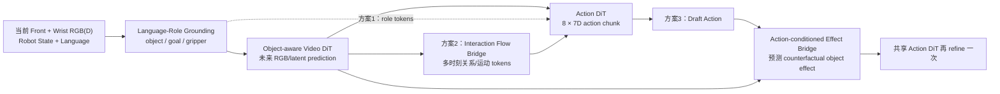
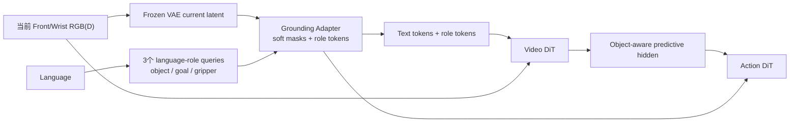
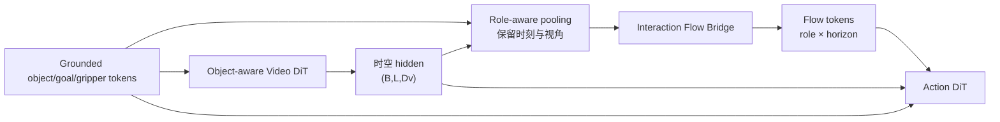
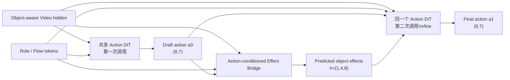

# Object-Centric Sim2Real WAM：三套可落地的 DiT4DiT 方案

日期：2026-07-24  
状态：方案设计，尚未修改模型、训练代码或数据 schema  
涉及项目：

- `/remote-home/jinminghao/DiT4DiT`
- `/remote-home/jinminghao/WAMs/ManiSkill`
- `/remote-home/jinminghao/datasets/maniskill_eort_large_v3_sim2real`

## 0. 最直白的结论

当前实现虽然已经使用 learned tracker，但 **object-centric 信息只在 Action DiT 侧出现**：

```text
当前 RGB + 语言
    → Video DiT
    → 普通整帧未来视频 hidden
                           ┐
robot state + tracker 18D ─┴→ 一个 flat state token
                               → Action DiT → 8×7D action
```

Video DiT 不知道哪些区域是 manipuland、goal 或 gripper，整帧 future-video loss 也不会特别重视小物体和接触区域。因此，下一步不应该只是继续把 tracker 向量做大，而应该让 object-centric 约束首先改变 Video DiT 学到的未来表征，再把这个表征显式送给 Action DiT。

建议的三套方案是：

| 优先级 | 方案 | 一句话 | 新增复杂度 | 推荐定位 |
| --- | --- | --- | --- | --- |
| 1 | **GOViT：Grounded Object-Weighted Video DiT** | 用语言角色查询生成 object/goal/gripper soft masks，把 role tokens 条件化 Video DiT，并让未来视频 loss 对交互区域加权 | 低 | 最先实现的可靠基线 |
| 2 | **RIFT-WAM：Relational Interaction Flow Token WAM** | 从 object-aware Video DiT hidden 预测 object/gripper/goal 的多时刻交互 flow tokens，再作为 Action DiT 的显式 bridge | 中 | 最推荐的主论文方案 |
| 3 | **CARE-WAM：Counterfactual Action-Response Effect WAM** | Action DiT 先给 draft action，action-conditioned effect bridge 预测物体后果，再用同一个 Action DiT refine；ManiSkill 分支 rollout 提供反事实监督 | 中高 | 最有因果性和新颖度的进阶方案 |

三个方案都不需要把 simulator segmentation、actor ID、object pose 或 future GT 作为部署输入。部署输入始终限制为：

```text
当前 front/wrist RGB（可选当前 depth）
+ 当前 robot proprioception
+ language instruction
```

Simulator privileged 信息只用作训练监督和评测标签。

## 1. 三套方案总流程图



共同思想是：

```text
不是：先单独 tracker 出一个位置，再把位置塞给 policy。

而是：先让 Video DiT 按任务角色理解和预测 object interaction，
      再把 object-aware predictive representation 交给 Action DiT。
```

## 2. 当前实现审计

### 2.1 当前 DiT4DiT 主链

当前官方最小改动入口是：

```text
examples/RLBench_EORT/train_files/
└── run_maniskill_eort_v3_joint_official_minimal.sh
```

实际合同为：

```text
当前视觉：
    front 224×224 + wrist 224×224
    → 每个时刻横向拼接为 (3,224,448)

视频时间：
    原始 t={0,1,...,8}
    ACTION_VIDEO_FREQ_RATIO=2
    → [I_t, I_t+2, I_t+4, I_t+6, I_t+8]

Video DiT：
    I_t 是条件帧
    后四帧监督 future-video flow-matching loss
    抽取固定层 hidden，shape 记为 (B,L,Dv)

状态：
    8D robot state → sin/cos → 16D
    17D learned-tracker message + 1D valid
    → 拼成 34D
    → 原始 state MLP
    → 一个 state token

Action DiT：
    encoder_hidden_states = Video DiT hidden
    hidden_states = [一个 state token, 八个 noisy action tokens]
    → 预测 (8,7) action chunk
```

当前设置还包括：

- Video DiT 和 Action DiT 全参数训练；
- text encoder 和 VAE 冻结；
- future-video loss 开启；
- `detach_hidden=true`，所以 action loss 不通过 bridge 更新 Video DiT；
- tracker 离线训练并冻结；
- object dynamics head 关闭；
- PushCube 与 PickCube 50/50 联合采样。

### 2.2 当前 object-centric 信息在哪里起作用

当前 learned tracker 输出：

```text
17D condition
├── ee_to_object.xyz              3D
├── ee_to_object_rotvec           3D（当前 learned 路径基本为 0）
├── object_to_goal.xyz            3D
├── object linear velocity        3D（当前为 0）
├── object angular velocity       3D（当前为 0）
├── contact force                 1D（当前为 0）
└── confidence                    1D

+ observation_valid               1D
```

真正有效的 learned 信息主要是两个相对位置、confidence 和 valid。它们只经过 Action DiT 的 state encoder，不参与：

- Video DiT 的输入条件；
- future-video loss 的空间权重；
- Video DiT hidden 的 object/goal/gripper 分解；
- 未来交互运动或接触的显式预测。

### 2.3 当前 dynamics head 也没有解决这个问题

已有可选 dynamics head 是：

```text
mean(Video hidden) + current state
    → Linear
    → h={1,4,8} 的 18D object Δxyz+Δrotvec
    → 写回 state
    → Action DiT
```

它的问题不是实现错误，而是能力边界：

1. 对 Video hidden 做全局 mean，容易丢掉小物体与接触位置；
2. 不读取 action，所以它预测的是专家轨迹中的未来意图，不是可干预的 forward dynamics；
3. object 信息仍没有反过来影响 Video DiT 的未来视频学习；
4. 18D 手工状态与 RGB future prediction 是两个松散目标，没有显式对齐。

### 2.4 ManiSkill 已经具备哪些监督

当前 v3 数据不用重新采集就可以派生方案 1 和方案 2 所需的大部分标签：

| 已有数据 | 可用于什么 |
| --- | --- |
| front/right/wrist RGB-D 256×256 | grounding、深度、跨视角一致性 |
| 每帧 segmentation + object/goal actor ID | 仅训练期生成 role mask |
| object/goal mask、bbox、centroid、visibility | grounding 与 future role prediction |
| TCP/object/goal pose，统一 robot-base frame | 3D relation 与 future motion 监督 |
| camera intrinsic/extrinsic | 2D↔3D 投影、跨视角一致性 |
| h={1,4,8} future object motion | object-effect 辅助监督 |
| robot-object measured contact | interaction/contact label |
| 完整逐帧 actor/articulation `env_states` | 方案 3 的 simulator branching 候选入口 |
| 8×7D robot-base metric action | Action DiT 与 action-conditioned effect |

仍需遵守的边界：

- actor ID、segmentation、GT pose、contact 和 phase 永远不能作为部署输入；
- PickCube 的绿色 goal marker 目前不是可靠的真实部署 goal，需要单独定义真实 goal source；
- wrist 标定和真实 image preprocessing 尚未闭合；
- 当前数据以成功专家轨迹为主，不等于恢复数据或反事实数据；
- Action DiT 采样有随机性，实验必须固定或重复 model-noise seed。

## 3. 方案一：GOViT

全称：

> Grounded Object-Weighted Video DiT

中文直译：

> 语言角色 grounding 条件化、交互区域加权的 Video DiT。

### 3.1 初衷

当前 Video DiT 的整帧 future-video loss 很容易被桌面、背景和大面积静态区域主导。PushCube/PickCube 中真正决定动作的是：

- gripper 将往哪里移动；
- object 是否被接触、推动或抓起；
- object 是否接近 goal；
- object/gripper 是否发生遮挡或失去可见性。

这些区域在整张 `224×448` 图像里占比很小。GOViT 的目标是用最小结构改动告诉 Video DiT：

```text
“这三个 role 是当前任务真正需要预测准确的区域。”
```

### 3.2 最小结构



建议只增加一个轻量 `GroundingAdapter`：

```text
输入：
    当前帧 VAE latent / patch feature
    language embedding
    三个固定语义 role query：
        manipuland
        goal
        gripper

输出：
    current role soft masks:
        M0 ∈ R^(B,3,Hl,Wl)

    role tokens:
        G0 ∈ R^(B,3,Dv)
```

`Hl,Wl` 使用 Cosmos VAE latent 的空间大小，不需要生成 224×448 的高分辨率 mask。

三个 role tokens 直接追加到 Video DiT 已有的 prompt embeddings：

```text
prompt_embeds =
    concat(language_tokens, object_token, goal_token, gripper_token)
```

这是当前 Cosmos 接口最小的条件注入点，不需要第一版就实现 ControlNet 或重写 2B Video DiT block。

### 3.3 如何让 future-video prediction 真正 object-centric

只加 role token 还不够，因为整帧 loss 仍会偏向背景。建议同时增加 latent-space object-weighted flow loss：

```text
W = 1
  + λ_obj     · M_object
  + λ_gripper · M_gripper
  + λ_goal    · M_goal
  + λ_contact · dilate(M_object ∩ M_gripper)
```

然后把当前 future-video flow-matching MSE：

```text
mean((v_pred - v_target)^2)
```

改为：

```text
sum(W · (v_pred - v_target)^2) / sum(W)
```

第一版不要替换原 RGB/latent video loss，而是保留全局项：

```text
L_video =
    L_global_flow
  + λ_focus · L_role_weighted_flow
```

这样可以防止模型只生成局部物体而破坏场景一致性。

### 3.4 Grounding 与未来 role 监督

训练期使用 simulator mask 生成监督，但模型输入只能是 RGB(D)+language：

```text
L_ground =
    Dice/BCE(current predicted role masks, current oracle role masks)

L_future_role =
    Dice/BCE(future role mask decoder(Video hidden), future oracle masks)

L_visibility =
    BCE(predicted per-role visibility, oracle visibility)
```

建议使用 role-separated valid：

```text
object_valid
goal_valid
gripper_valid
```

不要延续当前 tracker 的 `object AND goal` 全有或全无逻辑。

### 3.5 Object 信息如何进入 Action DiT

Action DiT 同时接收：

```text
encoder_hidden_states =
    concat(
        object-aware Video DiT hidden,
        object role token,
        goal role token,
        gripper role token
    )

state token =
    robot proprioception only
```

第一版可以完全移除 learned-tracker 18D，以验证视觉 grounding 本身；也可以保留 tracker 作为单独 ablation，但不能与主方案同时变化后直接比较。

### 3.6 总损失

```text
L =
    L_action
  + λ_video       L_global_video_flow
  + λ_focus       L_role_weighted_video_flow
  + λ_ground      L_current_role_mask
  + λ_future_role L_future_role_mask
  + λ_vis         L_role_visibility
```

第一阶段继续保持：

```text
detach_hidden=true
```

让 Video DiT 只由视频/grounding loss 学习，让 Action DiT 由 action loss 学习，避免一开始把所有梯度耦合。验证稳定后再做 `detach_hidden=false` 单变量消融。

### 3.7 为什么它适合 sim2real

优势：

1. mask/role 比 RGB texture 更少依赖材质和背景；
2. language-role query 可以支持不同物体类别，不再固定为 cube tracker；
3. 允许 role 部分可见，而不是整条 condition 清零；
4. object-aware Video hidden 仍保留 Cosmos 的大规模视频先验；
5. 当前 ManiSkill mask 可直接提供监督，不用重新采集。

限制：

1. simulator mask 监督并不自动保证真实 grounding；
2. PickCube 的 goal marker 必须换成真实可部署 goal 定义；
3. grounding mask 本身并不是全新研究点；
4. 若 Video DiT 的 VAE latent 空间过粗，小 cube 的 mask loss仍可能不稳定。

### 3.8 新颖度应如何表述

不能声称“第一次用 grounding mask 做机器人策略”。RoboGround 已明确使用 grounding masks 作为机器人策略的中间表示；Mask World Model 已直接预测语义 mask dynamics；Mask2Real-WM 也以 mask dynamics 连接 simulation 和真实 RGB rendering。

本方案更合理的贡献表述是：

> 在 DiT4DiT 的双 flow-matching 架构中，同一组 language-role grounding tokens 同时：
>
> 1. 条件化 Video DiT 的未来视频生成；
> 2. 对 future-video flow matching 进行 interaction-aware 空间重加权；
> 3. 作为 Action DiT 的显式 role condition；
> 4. 保留原始 predictive video hidden 作为 action cross-attention。

这是一个清楚、可做消融、且与现有代码高度贴合的组合贡献。

## 4. 方案二：RIFT-WAM

全称：

> Relational Interaction Flow Token World-Action Model

中文直译：

> 关系交互流 token 世界-动作模型。

这是三套方案里最推荐作为主线的方案。

### 4.1 初衷

GOViT 会让 Video DiT 更关注物体，但 Action DiT 仍需要从大量 Video hidden 中自己解析：

```text
object 将往哪里移动？
gripper 是否接近 object？
两者何时接触？
object 是否朝 goal 运动？
哪个视角当前可信？
```

当前简单 dynamics head 又把所有 Video hidden 做了全局 mean，几乎丢掉空间结构。

RIFT-WAM 在 Video DiT 和 Action DiT 之间增加一个小型、可解释的 bridge：

> 不预测完整 dense optical flow，而是预测 object/goal/gripper 的稀疏多时刻 interaction flow tube，再编码成少量 tokens。

选择稀疏 flow tube 是为了保留论文想法，同时避免第一版引入昂贵的稠密光流网络。

### 4.2 流程



Action DiT 最终同时收到：

```text
原始 predictive Video hidden
+ 当前 role tokens
+ future interaction-flow tokens
+ robot state token
```

### 4.3 什么是 interaction flow tube

当前视频时间点是：

```text
t={0,2,4,6,8}
```

对每个 role：

```text
R = {gripper, object, goal}
```

构造跨时间 tube：

```text
T_r =
[
    role position/feature at t0,
    Δrole at t2,
    Δrole at t4,
    Δrole at t6,
    Δrole at t8,
    visibility/confidence
]
```

第一版 bridge 不必把所有几何数值直接作为 Action DiT 输入。建议采用“learned token + 多任务可解释 decoder”：

```text
F ∈ R^(B, 3 roles × 5 horizons, Df)
```

并从每个 token 解码训练目标：

```text
每个视角的 Δu, Δv, Δdepth
robot-base frame 的 Δx, Δy, Δz
role visibility
gripper-object distance
object-goal distance
contact probability
```

其中 goal 是静态参考时，其 flow 应接近零；真正重要的是 object 相对 goal 和 gripper 相对 object 的关系变化。

### 4.4 标签如何得到

不需要重新采集：

1. 当前 raw 数据有逐帧 object/TCP/goal pose；
2. 有 front/wrist intrinsic 和 extrinsic；
3. 有逐帧 segmentation/depth；
4. 因此可以把每个 role 的 3D 点投影到两视角；
5. 从每帧 pose 序列直接派生 `t={0,2,4,6,8}` 的稀疏 scene-flow tube；
6. measured contact 只作 loss target。

对于对称 cube：

- 第一版只监督平移 flow；
- rotation 使用 symmetry-aware loss 或先关闭；
- 不应把等价 cube orientation 当作不同状态。

### 4.5 Bridge 接在哪里

不要再对 `last_hidden.mean(dim=1)` 做一次线性预测。建议：

```text
Video hidden
    → 恢复/保留 temporal-view token grouping
    → 用 role soft mask / role query 做 attention pooling
    → 每个 role、每个 horizon 得到一个 token
    → 2层轻量 Transformer 或 MLP
    → interaction flow tokens
```

伪 shape：

```text
Video hidden:       (B,L,Dv)
Role queries:       (B,3,Dv)
Pooled role tube:   (B,15,Df)   # 3 roles × 5 time points
Flow tokens:        (B,15,Df)
```

如果 Cosmos 当前 hidden 无法可靠恢复五个像素时间点，则第一版使用：

```text
3 role queries × 3 future horizons h={1,4,8}
```

即 `(B,9,Df)`，与已有 future-object 标签完全对齐。

### 4.6 Action DiT 的输入

```text
encoder_hidden_states =
    concat(
        Video DiT predictive hidden,
        current role tokens,
        interaction flow tokens
    )

hidden_states =
    concat(
        robot state token,
        noisy action tokens
    )
```

这里不再把 object 表征挤进一个 flat 34D state token。Role 和 flow 都作为 Action DiT 可以分别 attention 的条件 token。

### 4.7 损失

```text
L =
    GOViT 的全部 loss
  + λ_flow2d       L_multiview_uvd
  + λ_flow3d       L_robot_base_translation
  + λ_relation     L_ee_object_and_object_goal
  + λ_contact      L_contact
  + λ_consistency  L_cross_view_2D_3D_consistency
```

其中跨视角一致性是重要的 sim2real 约束：

```text
预测的 base-frame 3D point
    → 用已知相机标定投影到 front/wrist
    → 应与预测的两视角 2D flow 一致
```

训练时允许使用相机标定计算 loss；部署时如果 Action DiT直接使用 learned flow tokens，则不强制真实系统必须把 GT 几何送给 policy。

### 4.8 为什么比当前 18D dynamics 更好

| 当前 dynamics | RIFT-WAM |
| --- | --- |
| 全局 mean hidden | role-aware spatial/temporal pooling |
| 只预测 object 6D | 同时表示 gripper-object-goal interaction |
| 3个手工 future 向量 | 一组可 attention 的时序 role tokens |
| 无跨视角约束 | front/wrist 与 base-frame 几何一致性 |
| object 不影响 video loss | role grounding 与 object-weighted video loss共同训练 |
| 很难解释 hidden 是否真的看物体 | 可视化 flow tube、visibility、distance、contact |

### 4.9 Sim2Real 优势

1. 相对运动比绝对 RGB 外观更容易迁移；
2. robot-base 3D relation 可跨相机、跨机器人 adapter 使用；
3. 多视角一致性可降低单相机遮挡；
4. role token 可容忍部分可见和不同物体类别；
5. flow tube 是连续表征，不依赖 simulator phase ID；
6. 失败时可以直接可视化“模型认为 gripper/object 将如何移动”。

### 4.10 新颖度边界

对象 slot world model、mask world model和 hand-object flow 都已有相关工作。不能把“object slots”或“flow matching”单独当作新颖点。

RIFT-WAM 的潜在贡献组合是：

> 在一个预训练 Video DiT→Action DiT 双扩散策略中，用 language-grounded role queries 从 predictive video hidden 提取多视角、跨时间的 gripper-object-goal interaction flow tokens，并同时以 RGB future、role flow、3D relation和 action flow matching 联合优化。

相较于仅预测 mask 或仅预测 hand-object motion，它保留：

- 原始生成式 video hidden；
- 显式关系运动 bridge；
- 数值 action diffusion；
- 多视角 2D/3D consistency；
- 可部署的部分可见 role belief。

这套组合最贴近“object-centric sim2real WAM”的核心题目。

## 5. 方案三：CARE-WAM

全称：

> Counterfactual Action-Response Effect World-Action Model

中文直译：

> 反事实动作-物体后果世界-动作模型。

### 5.1 初衷

方案 1 和方案 2 的 future prediction 仍主要根据专家视频预测“接下来通常会发生什么”。如果模型没有读取候选 action，它无法区分：

```text
向左推会怎样？
向右推会怎样？
夹爪闭合或不闭合会怎样？
同一场景执行不同 action，object response 有何不同？
```

CARE-WAM 让 object bridge 成为真正的 action-conditioned effect model。

### 5.2 推理流程：只增加一次轻量 refine



不建议第一版做多轮 MPC 或多候选搜索。最小版本只做：

```text
一次 Video DiT forward
+ 一次 draft action
+ 一个小 effect bridge
+ 同一个 Action DiT 再 refine 一次
```

Action DiT 参数共享，不新增第二个大型 action model。

### 5.3 Effect Bridge 的输入输出

输入：

```text
object-aware Video hidden
+ current role/flow tokens
+ robot state token
+ draft action tokens a0 ∈ R^(B,8,7)
```

输出：

```text
h={1,4,8} 的 effect tokens

可解释 decoder：
    object Δxyz
    object Δrotvec（对称物体可关闭）
    gripper-object distance change
    object-goal distance change
    contact probability
    per-role visibility
```

和当前 dynamics head 的关键区别：

```text
当前：
    F(video, state) → future object

CARE：
    F(video, state, candidate action) → future object effect
```

### 5.4 为什么仅用专家轨迹还不够

如果训练数据里每个状态只有一个专家 action 和一个后果，模型可能仍然只学习相关性：

```text
看到这个画面
    → 专家通常这么动
    → object 通常这么变化
```

要证明模型真的使用 action，需要同一状态下的不同动作后果，也就是反事实数据。

### 5.5 ManiSkill 的独特优势：branching rollout

当前 HDF5 已保存逐帧：

```text
env_states/actors/*
env_states/articulations/*
```

理论上可以：

```text
恢复专家轨迹的某个状态 s_t
    ├── 执行原专家 action chunk      → outcome y_gt
    ├── 对 Δx/Δy/Δz 做小扰动         → outcome y_xyz
    ├── 对 gripper command 做扰动     → outcome y_grip
    └── 执行零动作/延迟动作           → outcome y_null
```

然后只保存轻量 counterfactual sidecar：

```text
state id
candidate action chunk
object/goal/TCP future pose
contact
success/valid
```

不必为每条分支重新保存完整视频。若需要视觉监督，可只保存少量关键帧。

注意：当前只确认 HDF5 有完整 actor/articulation state；正式实现前必须先做一个 state-restore + branch deterministic smoke，不能把“有 env_states”直接写成“branching 已经可用”。

### 5.6 训练方式

#### Stage A：先训练 effect model

```text
GT/counterfactual action
    → Effect Bridge
    → future object/contact/visibility
```

必须验证 action sensitivity：

```text
固定同一个 observation，
改变 candidate action，
预测 effect 必须发生合理变化。
```

#### Stage B：训练 draft-refine

训练时混合：

```text
GT action + noise
Action DiT draft action
counterfactual sampled action
```

Effect Bridge 对每个 candidate 预测后果，Action DiT refine 的目标仍是专家 action。

#### Stage C：可选 goal-consistency loss

仅使用可部署的连续目标：

```text
Push：
    predicted object-goal distance 应下降

Pick：
    predicted height/goal relation 应改善
```

不要把 simulator phase 或 success bool 直接作为 policy condition。

### 5.7 损失

```text
L =
    L_GOViT_or_RIFT
  + λ_effect      L_action_conditioned_object_effect
  + λ_contact     L_effect_contact
  + λ_sensitivity L_counterfactual_action_sensitivity
  + λ_refine      L_refined_action
  + λ_consistency L_predicted_effect_vs_video_role_flow
```

其中最关键的不是把 loss 堆多，而是保证：

```text
同状态、不同 action → 不同且正确的 object effect
```

### 5.8 Sim2Real 优势

1. effect model学习的是相对动作后果，不只是特定专家轨迹；
2. 可通过 action perturbation 学到接触边界和失败方向；
3. draft-refine 可以在执行前纠正明显不能推动/抓取 object 的 action；
4. object effect 使用 robot-base metric 表示，便于不同机器人 controller adapter；
5. simulator branching 可以产生真机难以安全收集的错误动作数据。

### 5.9 主要风险

1. simulator contact dynamics 与真机仍有差距；
2. counterfactual action 扰动范围太大会产生无意义或危险状态；
3. branch state restore 的确定性尚未验证；
4. 第二次 Action DiT 调用增加推理时间；
5. 如果 effect bridge 只见专家附近扰动，不能声称通用物理 world model；
6. recent work 已开始研究 visual action 与 action-conditioned mask world models，因此正式投稿前必须重新做更完整的 novelty 检索。

### 5.10 新颖度应如何表述

Masked Visual Actions 已展示用可视轨迹条件化视频模型来做 forward/inverse modeling；Mask2Real-WM 也已经研究 action-conditioned mask dynamics。

CARE-WAM 更合理的差异化方向是：

> 不把 action 直接变成整幅 visual action，也不训练独立 mask→RGB world model，而是在 DiT4DiT 的 predictive video hidden 与 numerical Action DiT 之间建立 counterfactual object-effect bridge；利用 simulator state branching 学习同状态不同 action 的后果，并以共享 Action DiT 做一次 draft-effect-refine。

真正可能形成贡献的是：

- counterfactual branch supervision；
- predictive video hidden 与 metric action effect 对齐；
- 同一 Action DiT 的单次 refine；
- interaction flow 与 action effect 的一致性；
- sim-only反事实监督向 real RGB observation 的迁移。

## 6. 三个方案的关系

三个方案既可以独立比较，也可以递进：

```text
当前 baseline
    ↓
GOViT
    object grounding 开始影响 Video DiT 和 Action DiT
    ↓
RIFT-WAM
    Video DiT hidden 显式产生 interaction flow bridge
    ↓
CARE-WAM
    interaction bridge 进一步读取 candidate action，学习 causal effect
```

最推荐的论文主叙事：

```text
Perceive what matters
    → Predict how roles interact
    → Act through predicted object effects
```

对应：

```text
Grounding
    → Interaction Flow
    → Counterfactual Action Effect
```

## 7. 可行性与选择建议

| 维度 | GOViT | RIFT-WAM | CARE-WAM |
| --- | ---: | ---: | ---: |
| 对现有 DiT4DiT 改动 | 小 | 中 | 中高 |
| 是否需要重新采集主数据 | 否 | 否 | 主数据否；需新建轻量branch数据 |
| 是否直接改变 Video DiT 学习 | 是 | 是 | 是 |
| 是否给 Action DiT 显式 object tokens | 是 | 是 | 是 |
| 是否显式预测 object interaction | 部分 | 是 | 是 |
| 是否 action-conditioned | 否 | 否 | 是 |
| 是否可做强可视化 | 高 | 很高 | 很高 |
| 主要 sim2real 表征 | role mask | relation/flow | action effect |
| 工程风险 | 低 | 中 | 中高 |
| 推荐级别 | 必做 | 主线 | RIFT有效后再做 |

最终建议：

1. **先实现 GOViT**，因为这是验证“object-centric video prediction 是否有用”的最短路径；
2. **把 RIFT-WAM 作为主方案**，因为它最贴合 WAM、object-centric、Video→Action bridge 和 sim2real 四个关键词；
3. **CARE-WAM 作为高价值进阶**，只有 RIFT flow token 对 closed-loop 有收益后再引入 counterfactual branching。

不建议现在直接：

- 上完整 Slot Attention 大系统；
- 新建第二个大型 Video DiT；
- 用 ControlNet 重写 Cosmos；
- 做多轮 MPC；
- 把 simulator phase/contact/pose 直接输入 policy；
- 同时改 action representation、数据任务和 Video backbone。

这些做法会让实验无法归因。

## 8. 最核心实验矩阵

为了让论文结论可解释，第一阶段只需要以下六组：

| ID | 模型 | 目的 |
| --- | --- | --- |
| B0 | 当前 tracker-flat DiT4DiT | 已有工程基线 |
| B1 | 无 tracker，普通 Video DiT + Action DiT | 判断 tracker 基线真正增益 |
| G1 | role tokens 只给 Action DiT | 判断 grounding 表征本身是否有用 |
| G2 | GOViT：role tokens 同时给 Video/Action，object-weighted video loss | 判断 object-centric video learning 是否有额外收益 |
| F1 | G2 + RIFT flow tokens | 判断显式 interaction bridge 是否有用 |
| C1 | F1 + action-conditioned effect + 单次 refine | 判断因果 effect 是否有用 |

如果加入 branch 数据，再增加：

| ID | 模型 | 目的 |
| --- | --- | --- |
| C2 | C1 + behavior-only effect data | 对照 |
| C3 | C1 + counterfactual branch data | 判断反事实监督本身的价值 |

必须保持：

- 相同 Cosmos base checkpoint；
- 相同 Push/Pick train split；
- 相同 front+wrist 输入；
- 相同 action representation；
- 相同 optimizer steps 和有效 batch；
- 相同 simulator seeds；
- 固定或重复 Action DiT noise seed；
- 每个结构至少报告参数量、吞吐和显存。

## 9. 评价指标

### 9.1 Video/object prediction

不要只报告全图 video loss。至少报告：

```text
全图 latent/video loss
object mask 内 loss
gripper mask 内 loss
object-gripper contact neighborhood loss
future role mask IoU
role centroid PCK / pixel error
visibility precision/recall/F1
```

### 9.2 RIFT

```text
front/wrist 2D flow error
depth error
robot-base 3D translation error（cm）
object-goal distance change error
gripper-object distance change error
contact F1
cross-view reprojection error
```

按以下条件分层：

- visible / partial / invisible；
- static / moving / contact；
- Push / Pick；
- front / wrist；
- fixed camera / camera randomization / geometry randomization。

### 9.3 CARE

除普通 future error 外，必须报告：

```text
同状态不同 action 的 effect separation
对 action perturbation 的响应斜率
zero-action baseline
expert-action baseline
counterfactual held-out action error
draft action 与 refined action 的闭环差异
```

若改变 action 后预测 effect 基本不变，就不能称为 action-conditioned dynamics。

### 9.4 Policy

```text
PushCube success
PickCube success
固定 seeds 的 paired success
多 ActionDiT noise seeds 的均值与置信区间
最大200步，完整8-step chunk
tracker/grounding invalid 分层
动作 clipping 和 workspace violation
```

Sim2Real 不能只做 simulator domain randomization。至少还需要：

- 真实 front/wrist RGB-D 离线 grounding；
- 真实标定下的跨视角重投影；
- 真实视频上的 role/flow 可视化；
- latency 与 invalid/fallback 测试；
- 最后才进入低速、安全真机闭环。

## 10. 建议的实施顺序

### Phase 0：先冻结研究合同

写清楚：

```text
部署输入：RGB(D) + robot state + language
训练监督：sim mask/pose/contact/future
禁止输入：actor ID/segmentation GT/object pose/contact GT/phase/future GT
goal source：visual marker / scene object / instruction geometry
```

尤其必须先解决 PickCube 真实 goal 的定义。

### Phase 1：GOViT 最小实现

建议新增而不覆盖原 baseline：

```text
DiT4DiT/model/modules/object_wam/
├── grounding_adapter.py
└── object_losses.py

DiT4DiT/model/framework/
└── DiT4DiT_GOViT.py

DiT4DiT/config/maniskill/
└── dit4dit_maniskill_govit.yaml
```

第一版只实现：

- 3 role queries；
- current/future role mask监督；
- role tokens 追加 prompt embeddings；
- object-weighted latent flow loss；
- role tokens 追加 Action DiT cross-attention；
- 一个 one-step smoke 和一个小数据 overfit。

### Phase 2：RIFT bridge

```text
DiT4DiT/model/modules/object_wam/
└── interaction_flow_bridge.py
```

先做 sparse flow tube，不做 dense optical flow：

- h={1,4,8}；
- gripper/object/goal 三类 token；
- 2D+depth、3D relation、visibility/contact decoder；
- cross-view consistency；
- token 追加 Action DiT cross-attention。

### Phase 3：CARE effect

```text
DiT4DiT/model/modules/object_wam/
└── action_effect_bridge.py

ManiSkill/scripts/eort/
└── collect_counterfactual_branches.py
```

顺序必须是：

1. state restore deterministic smoke；
2. 少量 branch sidecar；
3. effect model held-out check；
4. action sensitivity check；
5. 单次 Action DiT refine；
6. 最后才大规模 branch 数据。

## 11. 最没有信心的点

### 11.1 科学上最没有信心

当前 tracker-flat 模型在 simulator 已有较高 Push/Pick success。更复杂 object-aware Video DiT 是否还能稳定提升 closed-loop，而不是只让 mask/flow loss更好看，尚无证据。

因此必须保留 B0/B1/G1/G2，而不能只训练新模型。

### 11.2 工程上最没有信心

Cosmos 提取的固定层 hidden 是否保留了足够清晰的时空位置对应关系。当前代码把 hooked hidden 归一化成 `(B,L,D)`，但没有稳定公开的“每个 token 对应哪个时刻/视角/patch”合同。

这直接影响 RIFT 的 role-aware temporal pooling。实施前需要做：

```text
hidden token layout inspection
+ 人工 mask perturbation sensitivity
+ 时空 token 可视化
```

如果 token layout 无法可靠恢复，就采用 role query cross-attention，不依赖硬编码 token reshape。

### 11.3 Sim2Real 上最没有信心

真实 goal 来源和 wrist 标定。只要这两点没有闭合，再漂亮的 object-centric Video/Action bridge 也只能证明 simulator object reasoning，不能证明真实部署。

## 12. 与近期工作的关系和避免错误 novelty claim

以下是本方案设计时必须正视的相关方向：

1. [DiT4DiT](https://github.com/Mondo-Robotics/DiT4DiT)：Video DiT predictive hidden 条件化 Action DiT，是本项目的直接基础。
2. [Video Prediction Policy](https://arxiv.org/abs/2412.14803)：论证 video prediction hidden 可作为机器人策略的 predictive visual representation。
3. [Object-Centric World Model for Language-Guided Manipulation](https://arxiv.org/abs/2503.06170)：使用语言条件 object slots 预测未来状态并解码 action，说明“未来 object representation→action”本身已有直接先例。
4. [RoboGround](https://arxiv.org/abs/2504.21530)：grounding mask 作为机器人策略中间表示已有先例。
5. [Mask World Model](https://arxiv.org/abs/2604.19683)：直接预测 semantic mask dynamics，并连接 diffusion policy。
6. [FlowHOI](https://arxiv.org/abs/2602.13444)：以 flow matching 生成 hand-object interaction 序列，说明 HOI flow 表征已有相关路线。
7. [Mask2Real-WM](https://arxiv.org/abs/2607.04546)：action-conditioned mask dynamics + mask-to-RGB rendering 已直接瞄准 sim2real。
8. [Masked Visual Actions](https://arxiv.org/abs/2607.19343)：用可视轨迹表达 action，并支持 forward/inverse world modeling。

因此不能把以下内容单独声称为 novel：

- grounding mask；
- object slot；
- mask world model；
- optical/scene flow；
- action-conditioned video；
- future object state condition action policy。

本项目真正应争取的差异化组合是：

```text
DiT4DiT 双 flow-matching骨架
+ language-role grounding 同时进入 Video DiT 和 Action DiT
+ object-weighted future-video flow matching
+ multi-view 2D/3D relational interaction-flow tokens
+ simulator counterfactual branch 监督 metric action effect
+ draft-effect-refine 的共享 Action DiT
+ 完整 sim2real 输入边界和跨机器人 robot-base action contract
```

正式写论文前仍需要重新做系统文献检索；本文的“新颖”是基于当前检索和现有工程组合的研究判断，不是法律或学术意义上的首创证明。

## 13. 最终推荐

如果只选一个最值得做、又兼顾 novelty 与可实现性的方案：

> **选择 RIFT-WAM，但先以 GOViT 作为它的 Phase 1。**

最终主模型可以概括为：

```text
RGB(D) + Language
    → language-role grounding
    → object-conditioned Video DiT
    → future RGB hidden + gripper/object/goal interaction-flow tokens
    → Action DiT
    → metric action chunk
```

一句论文式核心 insight：

> A manipulation world model should not only imagine future pixels; it should explicitly predict how task-grounded roles interact, and expose those interaction dynamics to the action generator.

中文：

> 操作世界模型不应只想象未来像素，而应显式预测任务语义角色之间将如何交互，并把这种交互动力学直接暴露给动作生成器。

这比“再训练一个更强 tracker”更完整，也最贴合：

```text
Object-Centric
+ World-Action Model
+ Sim2Real
+ DiT4DiT 最小可继承改造
```
