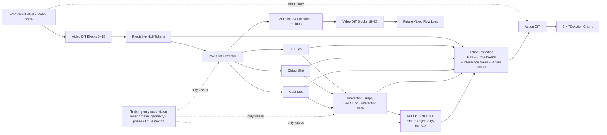

# Role-Slot Interaction Graph DiT4DiT 完整实现方案

日期：2026-07-27 UTC

状态：历史三节点方案；已由 `RSIG_DiT4DiT_FINAL_FEASIBLE_PLAN_CN_20260727.md` 取代，核心模型尚未修改

> 2026-07-27 修订：当前随机 sample loader 不支持跨 episode memory；第一版也不应强制预测不可见 goal 的精确位置。本文保留为设计推导记录，实际实现以最终可行方案为准。

目标：在尽量保留原版 DiT4DiT 双 flow-matching 主链的前提下，验证可部署的 object-centric interaction representation 是否同时改善未来建模和动作预测。

## 1. 结论

仅在 H18 上增加 EEF/Object/Motion 三个 slot 和几个辅助 head，结构合理但创新性不足。原因是近期工作已经覆盖 task-aware slots、object-addressable slots 和 dense optical-flow action representation。当前方案必须把贡献收敛为：

> 从 Video DiT 的预测 hidden 中抽取 EEF、Object、Goal 三个任务角色，构造 EEF→Object、Object→Goal 的交互图；用一个可部署的 Interaction State 表示当前阶段，并预测 EEF 与 Object 的多时间尺度未来运动。相同图 token 同时调制 Video DiT 后半段和 Action DiT。

建议命名为：

```text
Role-Slot Interaction Graph DiT4DiT
简称 RSIG-DiT4DiT
```

它与现有 learned tracker baseline 的本质区别不是把 17D condition 换成更多数字，而是让 Video DiT 内部形成可解释、可监督、可用于动作的交互状态。

## 2. 为什么单独预测 object motion 不够

object 短期不动不表示任务没有进展：

- Approach：EEF 正在接近 object，object motion 接近零。
- Establish interaction：EEF 已接近或接触，object 可能仍未明显运动。
- Manipulate/transport：EEF 与 object 协同运动，object 向 goal 接近。
- Release/settle：object 已到 goal，EEF 松开并远离，object 再次接近静止。

因此，`object future motion` 不能单独区分 Approach 和 Release，也不能表示交互建立过程。

`EEF 到 goal 的差值` 也不是合适的主表示。它跳过了被操作物体：EEF 接近 goal 可能是正确放置，也可能是绕过 object 的无效运动。应保留两条有明确物理含义的关系：

```text
r_eo = p_object - p_eef       # EEF → Object
r_og = p_goal - p_object      # Object → Goal
```

阶段应由关系、接触倾向和预测运动共同体现，而不是仅由一个距离阈值决定。

## 3. 完整模型结构



### 3.1 Role slots

```text
role_slots: (B, 3, 512)
slot 0: EEF
slot 1: target object
slot 2: goal / destination region
```

每个 role slot 从 H18 当前 observation 对应的 front/wrist tokens 中读取信息。第一版暂不依赖 instruction；PushCube 和 PickCube 使用 task ID/固定文本维持现有 DiT4DiT 数据合同。未来多物体、多指令实验再验证语言选择 object 的能力。

### 3.2 Interaction state

Interaction token 不是 simulator phase 的 embedding，而是模型从三个 role slots 和 robot state 推理得到的连续 latent：

```text
interaction_token: (B, 1, 512)
phase_logits:      (B, 4)
```

四类 canonical phase：

```text
0 approach       EEF 接近 object，尚未稳定交互
1 engage         接触、夹持或建立有效操作关系
2 manipulate     推、抓、运送或放置，object 朝 goal 变化
3 release/settle 目标接近完成，松开、撤离或稳定
```

`phase_logits` 是辅助监督输出。训练和推理送入 Action DiT 的是预测得到的 interaction token/soft probabilities，不是 GT phase。

### 3.3 双主体多时间尺度 plan

在 `h={1,4,8}` 预测：

```text
eef_future_delta_pos:    (B, 3, 3)
object_future_delta_pos: (B, 3, 3)
future_valid:            (B, 3)
```

每个 horizon 形成一个 plan token：

```text
plan_token_h = MLP([
    predicted_eef_delta_xyz_h,
    predicted_object_delta_xyz_h,
    predicted_phase_probability
])

plan_tokens: (B, 3, 2048)
```

只预测平移，不直接复制未来完整 action 的旋转和 gripper command。这样它表达高层交互计划，而 Action DiT 仍负责输出完整的 `8 × 7D` SE(3)+gripper 控制。

关系变化从双主体运动派生：

```text
Δr_eo(h) = Δp_object(h) - Δp_eef(h)
Δr_og(h) = -Δp_object(h)       # 当前任务 goal 静态
```

这使四个阶段有可检查的连续语义：

| 阶段 | EEF motion | Object motion | 关系变化 |
| --- | --- | --- | --- |
| Approach | 非零 | 约零 | `||r_eo||` 下降 |
| Engage | 小幅/调整 | 小或刚启动 | 接触概率上升、EEF/Object 开始共动 |
| Manipulate | 非零 | 非零 | EEF/Object 共动，`||r_og||` 下降 |
| Release/settle | 撤离或松开 | 约零 | goal 已近，`||r_eo||` 可上升 |

## 4. 数据合同

### 4.1 现有 v3 已有字段

现有 raw/sidecar 已包含：

```text
tcp_pose_base_wxyz             (T, 7)
object_pose_base_wxyz          (T, 7)
goal_pos_base                  (T, 3)
ee_to_object_base              (T, 3)
object_to_goal_base            (T, 3)
push/pick_interaction_phase    (T, 1)
object_future_delta_pos_base   (T, 3, 3)
object_future_delta_rotvec     (T, 3, 3)
object_future_valid            (T, 3)
front/wrist role visibility    (T, 1)
front/wrist bbox/centroid      (T, 4)/(T, 2)
```

其中 horizon 轴顺序固定为 `[1,4,8]`。

### 4.2 需要新增的派生字段

不需要重新采集数据。原始 HDF5 已有 action-aligned 的 `T+1` TCP pose、object pose、contact/grasp 和 success，可离线增加：

```text
eef_future_delta_pos_base      (T, 3, 3)
future_contact                 (T, 3)
future_grasp_or_engaged        (T, 3)
canonical_interaction_phase    (T, 1)
canonical_phase_valid          (T, 1)
```

Push/Pick 当前 phase 2 的语义不完全相同，不能直接当作共享分类标签。新 exporter 应用统一规则重新派生 canonical phase，同时保留原字段和 provenance，不覆盖旧数据。

### 4.3 严格因果边界

部署输入只有：

```text
front RGB + wrist RGB + robot state
```

在暂不研究 instruction conditioning 时，task identity 仍沿用现有固定任务文本。

以下 simulator 字段只能计算 loss/QA：

```text
segmentation mask / actor ID
GT object/goal/TCP metric pose
physical contact / is_grasped
GT phase
GT future EEF/object motion
```

Action DiT 只能接收模型预测出的 slots、interaction token 和 plan tokens。任何 future GT、oracle phase、contact 或 grasp 直接进入 policy 都构成泄露。

## 5. Video DiT 和 Action DiT 的接法

### 5.1 保留原版 DiT4DiT 主链

以下部分不变：

- Cosmos Predict2.5-2B Video DiT。
- 原 future-video flow-matching loss。
- H18 作为 Action DiT 的 dense cross-attention condition。
- Action DiT 的 flow-matching objective。
- 8-step、7D metric robot-base action chunk。
- front+wrist 横向组成 224×448。
- Video DiT 与 Action DiT 全参数训练；VAE 和 text encoder 冻结。

### 5.2 新增 condition

Action DiT cross-attention condition：

```text
[dense H18,
 EEF slot,
 Object slot,
 Goal slot,
 Interaction slot,
 Plan h1,
 Plan h4,
 Plan h8]
```

robot state 继续走 Action DiT 现有 state-token 路径，不和 GT object 数值拼成 flat vector。

### 5.3 新增 Video 路径

三个 role slots 和 interaction token 经 zero-init residual 注入 H18：

```text
H18_prime = H18 + alpha * CrossAttention(H18, role_and_interaction_slots)
alpha 初始为 0
```

`H18_prime` 进入 Video DiT 后续 blocks，使 slots 不只是 Action DiT 的外挂 condition。

为保持原版训练显存边界：

- Action-conditioning forward 继续使用 detached H18；action loss 不额外保留第二份 2B Video DiT 图。
- future-video-loss forward 在 H18 注入 live slots，并由 video/role loss 更新 Video DiT。
- 两个 forward 共享同一个 role/interaction module 参数，但使用独立 cache 和显式 forward mode。

## 6. Loss

主目标：

```text
L = L_action
  + λ_video L_future_video
  + λ_role L_role_heatmap
  + λ_rel L_current_relation
  + λ_phase L_phase
  + λ_plan L_dual_motion
  + λ_consistency L_relation_consistency
```

建议首版：

```text
λ_video       = 1.0
λ_role        = 0.1
λ_rel         = 0.1
λ_phase       = 0.05
λ_plan        = 0.1
λ_consistency = 0.05
```

这些只是 smoke 初值，正式训练前必须打印每项未加权 loss 的量级，避免辅助项淹没原 action/video loss。

Phase 类别严重不均衡，必须使用 train split 统计得到的 class weight 或 focal loss；不能依靠盲目 oversampling 破坏原 episode 分布。

## 7. 实施顺序

### Step 0：版本快照

已完成：

```text
ManiSkill: Jamee11/ManiSkill
branch: agent/maniskill-eort-oracle
commit: 105aaed

DiT4DiT: Jamee11/dit4wam
branch: agent/rlbench-eort-oracle
commit: 8e57f27
```

### Step 1：新增 v4 additive exporter

- 从现有 v3 raw/sidecar 离线派生 EEF future motion 和 canonical phase。
- 写入独立 `role_interaction_v1` 数据根目录。
- 不覆盖 learned-tracker LeRobot 数据。
- 增加 shape、时间对齐、future isolation、phase distribution 测试。

验收：Push/Pick train/val/test 全部 audit 通过，旧 dataset byte-for-byte 不变。

### Step 2：实现独立 RSIG 模块

- 新增 `RoleSlotExtractor`。
- 新增 role heatmap、relation、phase、dual-motion heads。
- 先用 synthetic tensor 做 shape/gradient/visibility-mask 测试。
- 输出使用具名 dataclass/dict，避免继续扩展 flat state offset。

验收：所有 head 有梯度；invalid horizon/不可见视角不产生 loss；GT 字段不出现在 deployment input。

### Step 3：接入 Action DiT

- 保留 dense H18。
- 追加 3 role + 1 interaction + 3 plan tokens。
- robot state 仍为独立 state token。
- 增加 `RSIG_ENABLED=false` 的严格 no-op parity。

验收：关闭 RSIG 时 checkpoint key、输出 shape 和 baseline loss 一致；开启时 Action 输入只增加 7 个预测 token。

### Step 4：接入 Video DiT

- 将原只读 detach hook 改为显式、可返回修改 hidden 的 adapter。
- 仅在 future-video-loss forward 使用 live slot residual。
- gate 零初始化。
- 增加两个 forward cache 不串扰的回归测试。

验收：初始 gate=0 时 Video 输出数值近似原模型；gate 非零时 role/video loss 都能更新 adapter，显存没有保留两份 2B 反向图。

### Step 5：一张卡 one-step 和四卡 smoke

依次运行：

1. loader-only 16 samples。
2. forward-only。
3. one-step backward。
4. 4 GPU、20 steps、保存并恢复 checkpoint。
5. 单个 Push/Pick episode 闭环，确认 video、action、phase overlay 均可保存。

该阶段只验证工程链路，不形成性能结论。

### Step 6：首先训练完整主模型

用户时间有限时，第一条新训练直接跑 Full RSIG，不再先训练 frozen probe：

```text
Full RSIG:
role + relation + phase + dual motion
+ slots to Action
+ zero-init slots to Video
+ original action/video losses
```

现有两个强对照无需重训：

```text
B0 robot-only original-style DiT4DiT
B1 learned-tracker flat condition DiT4DiT
```

Full RSIG 有正向信号后再训练三个最关键消融：

```text
A1 no phase
A2 object motion only, no EEF motion
A3 no slot-to-video, only Action condition
```

## 8. 创新性边界

### 8.1 与相关方案的区别

| 工作 | 已有核心 | RSIG-DiT4DiT 必须证明的新增点 |
| --- | --- | --- |
| DiT4DiT | Video hidden 条件化 Action DiT，双 flow matching | 将 dense predictive hidden 结构化成交互图，并反馈 Video 动力学 |
| STORM | task-aware slots 适配 frozen visual foundation model | slots 位于生成式 WAM 内部，同时驱动 future video 与 action |
| OA-WAM | robot/object addressable persistent slots | EEF→Object→Goal 关系、阶段感知双主体多尺度动力学 |
| FlowWAM | dense optical flow 作为统一 visual action representation | 稀疏语义角色、metric interaction plan、goal progress 和接触阶段 |

Flow 与 object-centric condition 不冲突：flow 描述“哪些像素在动”，RSIG 描述“谁与谁交互、为何运动、处于哪个阶段”。第一版不再并行增加 flow branch，以免一次改变过多变量。

### 8.2 什么情况下仍然不够创新

以下结果不足以支撑完整研究贡献：

- 只在 PushCube/PickCube ID split 提升。
- 只证明 simulator phase head 分类准确。
- slots 可以被 zero/shuffle 而成功率不变。
- role token 只送 Action，未实际改变 Video prediction。
- 使用 oracle phase、future motion、mask 或 GT pose 作为推理输入。
- 与 learned-tracker flat baseline 不做同预算比较。

## 9. 当前最不可靠的点

### 9.1 两任务接近 ceiling

learned-tracker 现有配对评估已到 Push/Pick 约 98%/98%。Full RSIG 即使正确，也很难在 ID success rate 上显示增益。必须加入：

- 物体位置/尺寸/摩擦 OOD。
- 相机、纹理、光照和遮挡 OOD。
- distractor object。
- 更长时、阶段更复杂的任务。

否则论文最可能失败在“没有足够实验空间”，而不是模型不能训练。

### 9.2 当前 phase 不是统一语义

Push phase 2 是 contact+object moving，Pick phase 2 是 native grasp。phase 1 极少且类别不平衡。共享训练前必须重派生 canonical phase，并报告规则和分布。

### 9.3 单帧阶段存在不可辨识性

Approach 和 Release 在局部画面中可能相似。当前 WAM 只有当前 observation condition，没有显式历史。简单任务可借助 object-goal 进度和 gripper state区分，但复杂任务、恢复动作和遮挡下不充分。

第一版先使用 soft phase + 双运动预测，不立即改时序输入。若 phase confusion matrix 显示 Approach/Release 严重混淆，再增加短历史 slot memory；不应把 persistent memory 和 RSIG 同时作为首轮变量。

### 9.4 EEF future prediction可能变成 action shortcut

GT EEF future 与 action 强相关。为避免复制 action label：

- 只预测 h=1/4/8 的 translation。
- 不预测未来旋转和 gripper command。
- GT 只进 loss，Action 只读 prediction。
- 必须比较 no-EEF-motion 消融。

### 9.5 Goal 并非总可见

wrist goal 可见率较低。Goal heatmap 必须按 view visibility mask 监督；Goal Slot 允许从 front/global context形成，不强迫每个视角定位不可见目标。真实场景若所有视角均不提供 goal 信息，模型不可能从视觉可靠推断。

### 9.6 Sim2Real 仍未闭合

当前真实 wrist calibration、图像 undistort/crop/resize 合同和在线时序同步尚未完成。仿真中的 metric relation head 只能证明结构可学，不能直接证明真实部署可用。

## 10. 最终决策

推荐实施 Full RSIG，但应保持下列边界：

```text
不再把 GT tracker condition 拼入 flat state；
不把 phase/接触/future GT 当作策略输入；
不删除 robot-only 和 learned-tracker baselines；
不先并行加入 optical flow、persistent memory 或 counterfactual selector；
不以 Push/Pick ID ceiling 作为主要创新证据。
```

最核心的论文假设是：

> 对动作真正有用的 world representation 不是完整像素 flow，也不是孤立的 object pose，而是 EEF、Object、Goal 之间随交互阶段变化的关系与双主体未来运动；将该表示作为 Video–Action 共享接口，可以提高任务忠实性和视觉/物理 OOD 下的控制鲁棒性。
