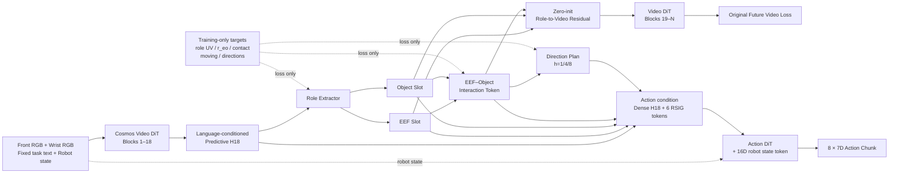

# RSIG-DiT4DiT 最终可行实现方案

日期：2026-07-27 UTC

状态：核心实现前的最终规格

参考文档：

- `ROLE_SLOT_INTERACTION_GRAPH_IMPLEMENTATION_PLAN_CN_20260727.md`
- `RSIG_DiT4DiT_Problems_and_Solutions_CN.md`

## 1. 最终结论

第一版不使用跨 episode memory，不预测精确 goal pose，不建立 Goal Slot，不训练四阶段 phase classifier。

最终结构收敛为：

```text
EEF Slot + Object Slot
        ↓
continuous EEF–Object Interaction Token
        ↓
h={1,4,8} EEF/Object coarse motion directions
        ↓
共享给 Video DiT 和 Action DiT
```

这仍称为 RSIG-DiT4DiT，但第一版的 graph 只有两个可部署节点和一条交互边：

```text
EEF ↔ Object
```

任务目标由原 DiT4DiT 的 language-conditioned dense H18 和未来生成主干保留；RSIG 不额外猜测不可见 goal 的精确位置。

## 2. 为什么删除 memory

当前 LeRobot loader 随机抽取独立时刻样本，不保证 batch 内样本按 episode 和时间连续：

```text
sample(t)
  = current observation
  + future video frames
  + 8-step action chunk
  + 同一 episode 内对齐的 auxiliary targets
```

因此可以监督 `t→t+1/4/8` 的局部未来，但不能训练需要跨多次 replanning 持久化的 recurrent memory。

第一版完全无状态：

```text
每次 forward 只依赖当前 sample；
episode reset 不维护 latent；
训练和推理没有 memory cache；
不声称显式识别完整 approach→release 历史阶段。
```

## 3. 为什么删除 Goal Slot

精确 Goal Slot 存在三个问题：

- wrist 或所有相机可能看不到 goal；
- goal 可能是区域、容器内部或抽象任务状态；
- 强制回归 simulator goal pose 会让模型学习不可部署的场景模板。

第一版因此删除：

```text
Goal Slot
goal pose regression
object_to_goal regression
goal heatmap loss
goal visibility head
phase 中依赖 goal-success 的监督
```

旧数据中的 goal/object-to-goal 字段继续保留用于已有 baseline 和离线 QA，但不进入 RSIG-v1 dataset、loss 或 Action condition。

RSIG 的“方向”不是指向某个 GT goal 的向量，而是从当前 predictive H18 预测的局部粗运动方向。

## 4. 最终模型流程



## 5. 输入与 token shape

部署输入保持原版式最小合同：

```text
front RGB
wrist RGB
task text
8D raw robot state → sin/cos → 16D state token
```

H18 已经经过 Cosmos text conditioning。第一版 Role Extractor 直接读取 H18，不再新增一套 language cross-attention。这样保留语言接口，但在只有固定任务文本的数据上不虚构 instruction-grounding 结论。

推荐内部 shape：

```text
dense H18:         (B, L, 2048)
role slots:        (B, 2, 512)
interaction token: (B, 1, 512)
plan tokens:       (B, 3, 2048)
```

送入 Action DiT：

```text
[dense H18,
 EEF slot,
 Object slot,
 Interaction token,
 Plan h1,
 Plan h4,
 Plan h8]
```

相对 baseline 只增加 6 个 cross-attention condition tokens。

## 6. 每个模块具体预测什么

### 6.1 EEF/Object Role Slots

两个 slot 从 H18 当前 condition temporal slice 中读取 front/wrist patch tokens。

辅助输出：

```text
EEF heatmap:    (B, 2, 14, 14)
Object heatmap: (B, 2, 14, 14)
```

第二维为 front/wrist。监督只需要 normalized UV Gaussian 和 visible mask，不需要在 LeRobot 中复制完整 segmentation mask。

### 6.2 Continuous Interaction Token

Interaction Token 不输出 phase one-hot，主要预测：

```text
current ee_to_object vector: (B, 3)
contact logit:               (B, 1)
object-moving logit:         (B, 1)
```

它能够表达：

```text
远 + 无接触 + object静止       → 接近前状态
近 + 接触 + object静止         → 建立交互
近 + 接触 + object运动         → 操作中
```

无 memory、无 goal 时，Approach 和完成后的 Release 在部分图像中不可辨识。第一版不增加人为 phase 标签来掩盖这一信息论限制。

### 6.3 Coarse Dual-Motion Direction Plan

每个 horizon 预测：

```text
EEF direction:       (B, 3)
Object direction:    (B, 3)
EEF moving logit:    (B, 1)
Object moving logit: (B, 1)
```

不回归精确 displacement magnitude，不预测 rotation，不预测 gripper command。

GT direction定义：

```text
delta = position(t+h) - position(t)
moving = ||delta|| > threshold
direction = delta / ||delta||        if moving
direction loss = 0                   otherwise
```

推荐初始阈值：

```text
EEF:    1 mm
Object: 1 mm
```

阈值保留为配置，因为真实传感器噪声和仿真数值精度不同。

这样：

- Approach 时由 EEF direction 表达进展；
- object 尚未响应时 Object moving probability 接近零；
- 操作时 EEF/Object 两个方向共同表达协同运动；
- 静止时不强迫网络为零位移猜一个方向。

## 7. 逐样本数据合同

### 7.1 不需要重新采集

现有 v3 raw/sidecar 已经包含：

```text
T+1 TCP pose
T+1 object pose
camera intrinsics/extrinsics
object mask centroid/visibility
contact
robot-base transform
```

可在当前 exporter 中离线派生所有 RSIG targets。

### 7.2 RSIG target tail

训练 sample 的 post-transform state：

```text
robot policy state: 16D
RSIG supervision:   44D
total training state: 60D
```

44D 顺序固定为：

```text
# role localization: 12D
EEF front/wrist uv              4
Object front/wrist uv           4
EEF/Object per-view valid       4

# current interaction: 5D
ee_to_object_base               3
contact                         1
object_moving                   1

# h=1/4/8 direction plan: 27D
EEF direction                   9
Object direction                9
EEF moving                      3
Object moving                   3
future valid                    3
```

合计：

```text
12 + 5 + 27 = 44
16 + 44 = 60
```

该设计低于当前 loader 的 64D state 上限，不需要修改通用 pad 长度。

### 7.3 数据变换

```text
robot 8D              → sin/cos → 16D
ee_to_object 3D       → train split q99
UV / direction        → 保持 normalized [-1,1]
contact/moving/valid  → binary
```

训练 framework 在计算 auxiliary loss 后只将前 16D 送入 Action state encoder：

```text
policy_state = state[..., :16]
targets      = state[..., 16:60]
```

推理时只需要 16D state；不存在 targets 也能正常运行。

### 7.4 EEF/Object UV

Object UV 使用现有 front/wrist mask centroid。

EEF UV 使用当前 TCP world point 和原始 camera intrinsic/extrinsic 投影得到：

```text
有效条件：
camera depth > 0
u/v 位于图像范围内
```

UV 归一化到 `[-1,1]`，resize 前后保持一致。

## 8. 严格防泄露

以下内容仅存在于训练 state tail：

```text
GT role UV
GT ee_to_object
GT contact
GT future EEF/Object direction
GT moving/valid
```

它们在送入 Action DiT 前被切除，而不是置零后保留为 44 个额外输入维度。

Action condition只能包含：

```text
H18
predicted role slots
predicted interaction token
predicted direction-plan tokens
16D robot state
```

必须有回归测试证明：

```text
任意扰动 GT target tail
→ predicted tokens不变
→ Action DiT输入不变
→ 只有 auxiliary losses变化
```

## 9. Action 与 Video 梯度边界

### 9.1 Action path

Action-conditioning H18 沿用原版 detach 行为，避免 action loss 保留第二份 2B Video DiT 计算图。

```text
detached H18
→ RSIG predictions
→ RSIG tokens + dense H18
→ Action DiT
```

Plan tokens 在第一版送 Action 前 stop-gradient：

```text
Action condition uses stopgrad(plan_tokens)
```

Direction head只由 direction/moving loss训练，避免被 action loss改造成隐式低频 action encoder。

Role/Interaction tokens保留 Action 梯度，但受 role/relation/contact loss约束。

### 9.2 Video path

第二次 future-video flow-matching forward 使用同一 RSIG module，在 live H18 上计算：

```text
H18' = H18 + alpha * CrossAttention(
    H18,
    [EEF, Object, Interaction]
)
```

其中：

```text
alpha = 0 at initialization
```

Plan tokens第一版不注入 Video DiT，避免 direction predictor与 future generator形成循环依赖。

两个 Cosmos forward：

```text
共享 RSIG 参数；
使用显式 forward mode；
使用独立 cache；
不保存跨 batch/episode memory。
```

## 10. Loss

```text
L = L_action
  + λ_video L_future_video
  + λ_role L_role_uv
  + λ_relation L_ee_to_object
  + λ_contact L_contact
  + λ_moving L_moving
  + λ_direction L_direction
```

定义：

```text
L_role_uv:
  visible view上的Gaussian heatmap KL/CrossEntropy

L_ee_to_object:
  normalized robot-base 3D SmoothL1

L_contact:
  current contact BCE

L_moving:
  current object-moving + future EEF/Object-moving BCE

L_direction:
  只在 moving & future_valid 上计算 1 - cosine_similarity
```

第一版没有：

```text
L_goal
L_phase
L_memory
L_object_to_goal
精确 displacement magnitude loss
```

辅助 loss权重先用小值并打印未加权量级；正式长训前根据一个 20-step smoke 的量级确定，不能预先假定所有项都用 0.1。

## 11. 最小代码改动范围

### ManiSkill

不修改环境和 collector。

仅修改/新增：

```text
现有 v3→LeRobot exporter：增加 --include-rsig-targets
一个 exporter focused test
生产/转换说明文档
```

旧 raw、sidecar、learned-tracker dataset 和 baseline 均不覆盖。

### DiT4DiT

复用现有 object-dynamics future-target 隔离模式，最小新增：

```text
一个 RSIG module文件
一个 RSIG DataConfig
DiT4DiT framework中的可选 RSIG分支
Cosmos H18 hook的可选 zero-init residual模式
训练配置/启动脚本
一个 model test + 一个 loader test
```

`RSIG_ENABLED=false` 时必须严格回到当前 baseline。

## 12. 实施顺序

### Step 0：数据出口

- 增加 44D RSIG targets。
- 导出独立 `lerobot/{split}/rsig_v1`。
- 增加 shape、投影、horizon 边界和 no-goal-dependency 测试。
- 统计 moving/contact/visibility 分布。

### Step 1：独立 RSIG module

- 用 synthetic H18/state targets验证所有输出 shape。
- 验证 invalid/motion mask。
- 验证 target tail 不进入预测。
- 验证所有 heads有梯度。

### Step 2：Action path

- 追加 6 个 tokens。
- Plan→Action stop-gradient。
- 推理只提供16D robot state。
- `RSIG_ENABLED=false` 做 no-op parity。

### Step 3：Video path

- 增加 optional zero-init residual。
- 两次 forward cache隔离。
- gate=0 做初始数值 parity。
- 验证 live H18 和 adapter有梯度，但不额外保留 Action侧2B图。

### Step 4：工程 smoke

顺序：

```text
loader-only
CPU synthetic model test
单GPU forward
单GPU one-step backward
4GPU 20-step
checkpoint save/resume
Push/Pick各1个闭环episode
```

### Step 5：第一条正式训练

不单独训练 tracker，不需要 episode-memory pretraining。

直接训练 Full RSIG：

```text
原 action loss
+ 原 future-video loss
+ role/relation/contact/moving/direction losses
+ roles→Video residual
+ roles/interaction/directions→Action
```

保持：

```text
Video DiT全参数
Action DiT全参数
VAE frozen
text encoder frozen
front+wrist
4 GPUs
与 baseline相同 batch/steps/optimizer
```

## 13. 最小实验矩阵

已有：

```text
B0 robot-only DiT4DiT
B1 learned-tracker flat condition
```

新增主实验：

```text
R0 Full RSIG-v1
```

只有 R0 有正向信号后再训练：

```text
A1 no direction plan
A2 object direction only，去掉 EEF direction
A3 no role-to-video residual
```

推理时无需重训的干预：

```text
zero RSIG tokens
shuffle Object Slot
reverse predicted direction
```

## 14. 验收和停止条件

### 数据 Gate

- 训练 state严格为60D，推理严格接受16D。
- old datasets和baseline不变。
- missing goal字段不影响RSIG export。
- target tail任意变化不影响Action input。

### 模型 Gate

- visible role localization显著优于uniform/random。
- moving frame的direction cosine显著高于零。
- zero/shuffle/reverse干预会改变action，证明Action使用RSIG。
- role-to-video gate不长期停留在零，且核心区域video误差不恶化。

### 停止条件

- Role/Direction在训练集都无法拟合：停止长训，先检查H18 slice与标签。
- Action对zero/shuffle完全不敏感：不继续堆模块，改condition bottleneck。
- 只有ID辅助loss下降、OOD控制无收益：不能主张object-centric robustness。
- 需要GT goal、phase或memory才能工作：该第一版假设失败，不把oracle补丁加入策略。

## 15. 研究贡献的准确表述

第一版不再声称：

```text
显式恢复完整task phase
预测精确goal位置
维护长期object memory
instruction-grounded多物体选择已经成立
```

建议主张：

> RSIG-DiT4DiT 将生成式 Video DiT 的 dense predictive hidden 分解为 EEF/Object roles、当前交互关系和多时间尺度粗运动方向，并将同一可部署表示作为 future-video 与 action-generation 的共享桥梁。它专门表达“机器人正在运动但物体尚未运动”和“机器人与物体协同运动”之间的差别，而不依赖精确 goal、离散 phase 或跨 episode memory。
