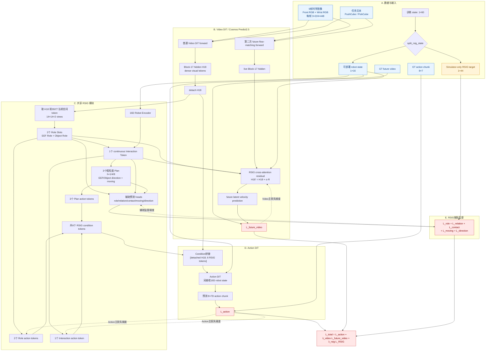
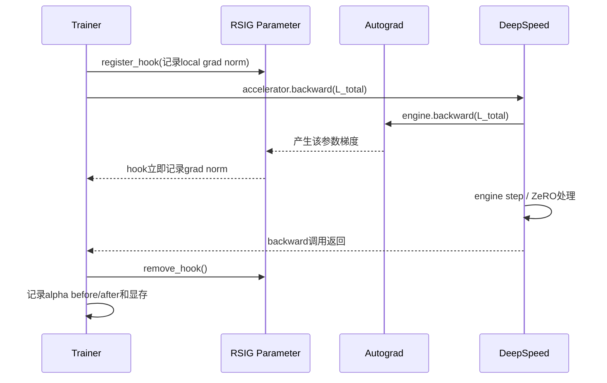

# RSIG-DiT4DiT 完整前向、反向与梯度流说明

更新时间：2026-07-28 11:48:15 UTC
对应 DiT4DiT 代码版本：`cc775e8`

## 1. 先给出核心结论

当前 RSIG 不是只挂在 DiT4DiT 外面的辅助预测头。它通过两条真实的主任务路径进入模型：

1. **Action 路径**：从 Video DiT 第 17 层的隐藏表示中提取 EEF/Object Role、Interaction 和粗粒度 Motion Plan，形成 6 个新 token，拼到原始 Video hidden tokens 后面，直接作为 Action DiT 的 condition，因而会改变 action chunk。
2. **Video 路径**：同一套 Role/Interaction 表示通过一个零初始化 gate 的 cross-attention residual，注入第二次 future-video flow-matching forward 的 Video DiT 第 17 层，因而会改变 future-video 预测。

训练时总损失为：

```text
L_total
  = L_action
  + λ_video · L_future_video
  + λ_rsig · (
        λ_role · L_role
      + λ_relation · L_relation
      + λ_contact · L_contact
      + λ_moving · L_moving
      + λ_direction · L_direction
    )
```

随后只执行一次 `backward(L_total)`。所以 RSIG 中间表示确实参与主模型前向和反向，而不是仅用于日志或可视化。

但必须准确区分当前各分支的梯度边界：

- Role token 和 Interaction token 接受 **Action 主损失**梯度。
- Video residual 接受 **future-video 主损失**梯度。
- Motion Plan 当前会进入 Action DiT 前向，但整组 `plan_tokens` 被 `detach()`，所以 Plan 分支只接受 RSIG auxiliary loss，不接受 Action 主损失。
- 原始 H18 在送入 Action DiT 前已 detach，所以 Action loss 不回传 Video DiT；Video DiT 仍由 `future_video_loss` 全参数训练。

## 2. 完整实现流程图

图中：

- 实线表示前向数据流；
- 红色虚线表示损失反向传播；
- 灰色虚线表示明确的 stop-gradient；
- 44D simulator target 只用于监督，不进入部署时的 policy condition。



## 3. 数据输入到底是什么

### 3.1 每个训练样本

| 内容 | Shape | 是否部署时可用 | 用途 |
| --- | --- | --- | --- |
| 时序图像 | 5 × `(3,224,448)` | 是 | 每帧由 front 与 wrist 两张 224×224 RGB 横向拼接 |
| instruction | `str` | 是 | 当前 Push/Pick 任务文本 |
| training state | `(1,60)` | 仅前16D | 16D robot state + 44D RSIG target |
| action target | `(8,7)` | 训练标签 | 8步 metric robot-base action chunk |
| future video | loader内部视频张量 | 训练标签 | Video DiT flow-matching 监督 |

这里的“5帧图像”和“8步 action horizon”是两个不同维度：

- 5帧是 observation temporal context；
- 8步是一次预测并执行的 future action chunk；
- 不能把它理解成5帧对应5个动作。

### 3.2 60D state 的硬隔离

训练 state 被物理切成：

```text
state_train = [robot_state_16D, rsig_target_44D]
```

其中：

- `robot_state_16D`：由原始 robot 8D 状态做 sin/cos 编码得到，是训练和推理都能使用的 policy input；
- `rsig_target_44D`：来自 simulator GT，只用于计算 auxiliary loss；
- Action DiT、RSIG forward 和推理都只接收前16D；
- 推理直接接收 `(1,16)`，不需要伪造44个零值。

因此 44D target 不会作为 privileged condition 泄漏给 Action DiT。

### 3.3 44D RSIG target 的顺序

```text
0:8    EEF/Object × front/wrist normalized UV
8:12   EEF/Object × front/wrist valid
12:15  robot-base ee_to_object xyz
15     current physical contact
16     current object moving
17:26  EEF h1/h4/h8 unit direction
26:35  Object h1/h4/h8 unit direction
35:38  EEF h1/h4/h8 moving
38:41  Object h1/h4/h8 moving
41:44  h1/h4/h8 future valid
```

它监督的是“角色在哪里、当前如何交互、未来大致往哪个方向动”，不强制回归精确 goal pose，也不使用跨 episode memory。

## 4. RSIG 内部具体做了什么

### 4.1 Role Slots

代码从 H18 的前 `14×14×2=392` 个当前空间 token 中提取两个 role：

```text
Q_role = {q_eef, q_object}
K = Linear(H18_current)
V = Linear(H18_current)
Attention = softmax(Q_role Kᵀ / √d)
RoleSlots = Attention V
```

得到：

```text
S_eef    ∈ R^slot_dim
S_object ∈ R^slot_dim
```

同一 attention map 被 2D Gaussian role loss 监督，使两个 slot 分别聚焦 EEF 和目标物体，而不是仅靠 action loss 自行形成不可解释 token。

### 4.2 Interaction Token

16D robot state 先经 MLP 编码：

```text
R_robot = RobotEncoder(state_16D)
```

再与两个 role slot 拼接：

```text
I = InteractionEncoder([S_eef, S_object, R_robot])
```

`I` 是连续 Interaction Token。它不是人工离散 phase ID，但通过以下目标约束交互含义：

- `ee_to_object.xyz`
- `physical_contact`
- `current_object_moving`
- future EEF/Object direction 与 moving

因此在物体短时间静止但夹爪正在接近时，EEF direction 和当前 `ee_to_object` relation 仍能提供“正在靠近”的信息；不需要强行预测精确 goal。

### 4.3 Motion Plan

从 Interaction Token 预测3个时间尺度：

```text
h ∈ {1,4,8}
每个h输出：
  EEF direction xyz
  Object direction xyz
  EEF moving probability
  Object moving probability
```

所以每个 horizon 为8D，3个 horizon 共24D raw prediction。方向归一化为 unit vector，静止/无效帧不强迫拟合方向。

### 4.4 给 Action DiT 的6个 token

```text
2 × Role token
1 × Interaction token
3 × Plan token
= 6 × hidden_dim
```

它们与原始 dense H18 拼接：

```text
ActionCondition = concat(
    detached_video_H18,
    role_tokens[2],
    interaction_token[1],
    detached_plan_tokens[3]
)
```

Action DiT 同时接收16D robot state，并预测 `(8,7)` action chunk。

## 5. 新增部分如何作用到 Action DiT

Action 路径可以写成：

```text
H18_detached
   ├─直接作为原版 dense video condition──────────────────┐
   │                                                     │
   └─RSIG → Role/Interaction/Plan → 6 tokens────────────┤
                                                         ▼
                                             Action DiT → action loss
```

这里最重要的事实是：

1. **不是用 RSIG token 替换 H18**，而是保留原版 H18，再附加6个结构化 token；
2. Role/Interaction token 改变 Action DiT 的 condition sequence；
3. Action loss 会更新 `role_to_hidden`、`interaction_to_hidden`，并继续更新其上游 Role/Interaction 提取模块；
4. Action loss 不会更新 Video DiT，因为原版边界仍设置 `COSMOS_DETACH_HIDDEN=true`；
5. 当前 Plan token 在进入拼接前整体 detach，所以会改变 forward，但 Action loss 不会训练 Plan 分支。

换言之，当前 Action 分支真正由主损失联合训练的是：

```text
Role extraction
  + Robot encoder
  + Interaction encoder
  + Role/Interaction到Action hidden的投影
  + Action DiT
```

## 6. 新增部分如何作用到 Video DiT

Video DiT 在一次训练样本中有两个相关 forward。

### 6.1 第一次：提取给 Action DiT 的 H18

第一次普通 Video DiT forward 在 block 17 注册 hook：

```text
Video DiT → block 17 → capture H18.detach()
```

此时：

- 不启用 RSIG video injection；
- 得到的 H18 保留原版表示；
- H18 被 detach 后送给 Action/RSIG action-side 路径；
- Action loss 不会沿 H18 回到 Video DiT。

### 6.2 第二次：训练 future-video flow matching

构造 rectified-flow 中间 latent：

```text
x_t = (1-t)x_0 + tz
target velocity = z - x_0
```

第二次调用 Video DiT 时，block-17 hook 启用 RSIG adapter：

```text
H18_live
  → 从当前front+wrist token提取Role/Interaction
  → 所有H18 token cross-attend到 {EEF Role, Object Role, Interaction}
  → residual R
  → H18' = H18_live + video_alpha × R
  → 后续Video DiT blocks
  → future velocity prediction
  → L_future_video
```

这里使用的是 **live H18**，没有 detach，所以 future-video loss 能沿该路径反向传播。

### 6.3 为什么 `video_alpha` 初始化为0

初始：

```text
video_alpha = 0
H18' = H18
```

这样第一步 forward 与原版 Video DiT 完全一致，避免随机初始化 adapter 立刻破坏预训练 backbone。

梯度行为是：

```text
∂L/∂alpha = <∂L/∂H18', R>             通常可以非零
∂L/∂R     = alpha · ∂L/∂H18'          alpha=0时为零
```

因此预期：

- 第1个 optimizer step：`video_alpha_grad_norm > 0`；
- 第1步时 `video_out_grad_norm == 0` 是正常现象；
- gate 更新离开0后，第2步及之后 `video_out`、`video_query` 和共享 Role/Interaction 才应从 video loss 得到梯度。

这不是“梯度断了”，而是零初始化 residual gate 的数学结果。

## 7. 每个损失到底更新哪些模块

| 模块/参数 | Action loss | Future-video loss | RSIG auxiliary loss | 当前状态 |
| --- | --- | --- | --- | --- |
| Action DiT | 是 | 否 | 否 | 全参数训练 |
| Video DiT transformer | 否，H18已detach | 是 | 否 | 全参数训练 |
| EEF/Object Role extractor | 是 | gate非零后是 | 是 | 三条路径共享 |
| Robot encoder | 是 | gate非零后是 | 是 | 进入Interaction |
| Interaction encoder | 是 | gate非零后是 | 是 | 三条路径共享 |
| `role_to_hidden` | 是 | 否 | 否 | Action专用投影 |
| `interaction_to_hidden` | 是 | 否 | 否 | Action专用投影 |
| `plan_head` | **否** | 否 | 是 | 当前按设计stop-gradient |
| `plan_to_hidden` | **否** | 否 | **否** | 当前被整组output detach阻断 |
| `video_alpha` | 否 | 第1步起是 | 否 | 零初始化gate |
| `video_query` / `video_out` | 否 | gate非零后是 | 否 | Video专用adapter |
| relation/contact/moving heads | 否 | 否 | 是 | 只负责语义监督 |
| Text encoder / VAE | 否 | 否 | 否 | 延续原版冻结设置 |

### 7.1 当前 Plan stop-gradient 的一个具体隐患

当前代码是：

```python
plan_tokens = self.plan_to_hidden(plan_features)
action_tokens = torch.cat(
    (role_tokens, interaction_token, plan_tokens.detach()),
    dim=1,
)
```

这会同时阻断：

- Action loss → `plan_head`
- Action loss → `plan_to_hidden`

`plan_head` 仍由 direction/moving auxiliary loss 训练，但 `plan_to_hidden` 不被任何 loss 训练，实际成为一个固定随机投影。Plan token 仍会随 `plan_features` 变化并影响 Action forward，但其映射本身不会学习。

如果目标只是“Action loss 不反向污染 Plan predictor”，更合理的最小写法通常是：

```python
plan_tokens = self.plan_to_hidden(plan_features.detach())
```

这样：

- `plan_head` 仍只由明确的 direction/moving label 训练；
- `plan_to_hidden` 可以由 Action loss 学会如何把可靠的8D plan 编成 Action DiT 易用的 token。

这是本次代码审查发现的真实设计风险。本说明文档没有擅自修改核心逻辑；按项目规则，应在用户确认后再做这一行的可逆改动和对应消融。

## 8. “梯度报错”具体是什么问题

### 8.1 不是模型梯度本身报错，而是旧诊断读取时机错误

旧实现大致为：

```text
accelerator.backward(total_loss)
    └─ DeepSpeed engine.backward(...)
    └─ DeepSpeed进入engine.step/ZeRO梯度处理

safe_get_full_grad(parameter)   ← 此时才读，已经太晚
```

所以 DeepSpeed 报：

```text
ValueError:
Gradients are only available immediately after backward and before engine step
```

它表达的是：

> ZeRO 分片下，完整梯度只能在 backward 刚完成、engine step 尚未开始的短窗口读取。

这不能证明 `video_alpha`、Role 或 Interaction 没有梯度；只是旧的诊断代码错过了可读取窗口。

### 8.2 为什么普通 `.grad` 或 `safe_get_full_grad` 不适合放在那里

在非 DeepSpeed 单卡训练中，经常可以：

```python
loss.backward()
print(parameter.grad.norm())
optimizer.step()
```

但 ZeRO-2 会分片和管理梯度；而当前 Accelerate/DeepSpeed 包装把 backward 与 engine 的 step/梯度处理封装在一起。`accelerator.backward()` 返回后再查询完整梯度，不再满足 DeepSpeed 的时序约束。

### 8.3 当前修复：在 autograd 产生梯度时用临时 hook 捕获

现在的顺序为：



监控参数包括：

```text
video_alpha
role_to_hidden.weight
interaction_to_hidden.weight
video_out.weight
```

优点：

- hook 在梯度产生的瞬间执行，早于 DeepSpeed 清理/分片状态变化；
- 不再调用 `safe_get_full_grad`；
- 不需要额外聚合完整2B模型梯度；
- 只在 smoke/calibration 开启，正式40k训练应关闭以避免诊断开销。

限制：

- 记录的是当前 rank、当前同步边界处的局部参数梯度范数；
- 它用于证明“路径是否连通”和判断数量级，不等于全局 effective-batch gradient norm；
- 未触发 hook 会记录0，必须结合当前 gate 状态解释。

## 9. 两次报错需要分开理解

### 9.1 已修复的 dtype 错误

第一轮真实 GPU smoke 曾报：

```text
expected m1 and m2 to have the same dtype,
but got float != c10::BFloat16
```

原因是第二次 future-flow forward 构造的完整 latent 为 float32，而 Cosmos patch embedding 权重是 bf16。现在进入 transformer 前显式转换到 `transformer_dtype`。这是一个真实 forward bug，已修复。

### 9.2 后续 log 同时存在的 GPU/NVML 环境问题

日志：

```text
Can't initialize NVML
Device: cpu
```

说明那次进程实际上没有拿到 CUDA。它与上述 DeepSpeed 梯度诊断时序问题是两个独立问题：

- NVML/CUDA 问题决定“是否真的在GPU运行”；
- `safe_get_full_grad` 问题决定“ZeRO下何时读取梯度”。

当前 launcher 已增加 CUDA fail-fast，避免再次在 CPU 上加载2B模型后才失败；但尚未在恢复正常的真实 GPU 环境中完成新版一步 smoke。

## 10. 下一次 smoke 应该看到什么

第1个 optimizer step 的最低通过条件：

```text
Device: cuda:0
action_dit_loss                         finite
future_video_loss                       finite
rsig_role_loss                          finite
rsig_relation_loss                      finite
rsig_contact_loss                       finite
rsig_moving_loss                        finite
rsig_direction_loss                     finite

rsig_diag/action_role_projection_grad_norm         > 0
rsig_diag/action_interaction_projection_grad_norm  > 0
rsig_diag/video_alpha_grad_norm                     > 0
rsig_diag/video_out_grad_norm                       = 0  # 第一步预期
video_alpha_before_step != video_alpha_after_step
```

随后至少再跑2步验证：

```text
video_alpha 已离开0
rsig_diag/video_out_grad_norm > 0
```

还必须核对：

- `last_video_hidden_shape` 确实符合 front+wrist 的 `14×28` 空间布局；
- 无 dtype、shape、OOM、NaN；
- Action/Video/五项 auxiliary loss 数量级没有某一项完全淹没其余损失；
- checkpoint 能保存并 resume。

只有这些通过，才说明：

1. RSIG Action 条件路径真实参与 Action 主损失；
2. RSIG Video residual 真实参与 future-video 主损失；
3. 零初始化 gate 已正确打开；
4. 当前实现可以进入4 GPU、20-step校准。

## 11. 当前实现与原版 DiT4DiT 的边界

保留的原版核心逻辑：

- Video DiT 预测 future video dynamics；
- Action DiT 同时使用 Video hidden state 和 robot state；
- Video/Action 两个 DiT 都全参数训练；
- Action loss 不通过 detached H18 回传 Video DiT；
- Text encoder 与 VAE 冻结；
- Action 输出仍为 `(8,7)`，没有改 action space。

新增且可关闭的部分：

```text
H18
  → EEF/Object roles
  → continuous interaction
  → coarse multi-horizon motion plan
  → 6 Action condition tokens
  → optional zero-init Video residual
  → 5项simulator-supervised auxiliary losses
```

设置 `RSIG_ENABLED=false` 可回到保留的原版/既有 baseline 路径；新增实现没有删除 baseline。

## 12. 当前最没有信心、也最应该先验证的三点

1. **真实2B checkpoint的H18空间合同**：代码预期 current front+wrist 为392个空间 token，但必须以真实GPU shape诊断确认，synthetic test不能代替。
2. **Plan token 的固定随机投影**：当前 detach 位置让 `plan_to_hidden` 完全不训练。它可能削弱Plan condition，应在确认后改为只 detach `plan_features`，并保留当前版本作为消融。
3. **辅助损失权重和 gate 动态**：五项权重当前都以1作为起点，尚无20-step真实GPU量级证据；不能直接据此启动40k并声称稳定。

因此最短且可靠的后续顺序仍是：

```text
真实GPU 1-step
  → 真实GPU 2-step确认video_out梯度
  → 4 GPU 20-step loss/gate/显存校准
  → save/resume
  → 再决定40k
```

## 13. 对应代码位置

- RSIG state切分、Role/Interaction/Plan和Video adapter：
  `/remote-home/jinminghao/DiT4DiT/DiT4DiT/model/modules/rsig.py`
- RSIG与Video/Action主干的拼接：
  `/remote-home/jinminghao/DiT4DiT/DiT4DiT/model/framework/DiT4DiT.py`
- Cosmos block-17 hook和future flow-matching forward：
  `/remote-home/jinminghao/DiT4DiT/DiT4DiT/model/modules/vlm/Cosmos25.py`
- 总损失、一次backward和ZeRO-safe梯度诊断：
  `/remote-home/jinminghao/DiT4DiT/DiT4DiT/training/train.py`
- 数据导出与44D schema：
  `/remote-home/jinminghao/DiT4DiT/examples/RLBench_EORT/scripts/convert_maniskill_eort_to_lerobot.py`
