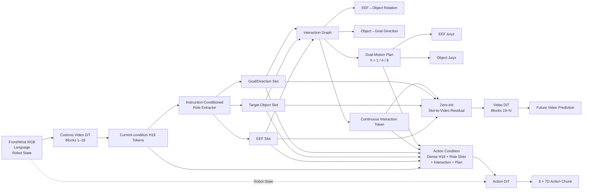

# RSIG-DiT4DiT：当前问题、修订方案与第一版实现说明

日期：2026-07-27
状态：设计修订版，建议在正式长训练前按本文完成工程与科学验证

---

## 1. 当前研究目标

现有 DiT4DiT 使用 Cosmos Predict 2.5 的中间隐藏表征作为 Action DiT 的条件。该结构能够生成视觉上合理的未来，并据此预测动作，但仍存在一个关键问题：

> **视觉上合理的未来，不一定与任务目标、目标物体和实际交互过程一致。**

机器人操作真正需要准确建模的是：

- 末端执行器（EEF）正在接近哪个物体；
- 当前目标物体是否被正确选择；
- 物体应当朝什么方向或目标状态变化；
- EEF 与物体是否建立了有效接触或协同运动；
- 这些信息是否真正同时帮助未来视频预测和动作预测。

因此，当前方案不再只增加 object heatmap 或 future-object head，而是尝试从 Video DiT 的预测隐藏表征中构造一个结构化的任务交互表示。

建议模型名称：

> **RSIG-DiT4DiT：Role-Slot Interaction Graph DiT4DiT**

---

## 2. 当前方案的核心假设

RSIG-DiT4DiT 的核心假设是：

> 对机器人动作真正有用的世界表征，不只是完整像素视频，也不是孤立的 object pose，而是 EEF、目标物体和目标方向之间的关系，以及 EEF 与物体在多个未来时间尺度上的协同运动。

模型首先从 Cosmos Predict 2.5 第 18 个 block 的 hidden states 中提取三个任务角色：

1. **EEF Slot**：末端执行器相关信息；
2. **Object Slot**：指令指定的目标物体；
3. **Goal/Direction Slot**：目标状态、目标方向或 object-to-goal belief。

然后构造：

- EEF→Object 关系；
- Object→Goal/Direction 关系；
- 连续 Interaction State；
- EEF 与 Object 的多时间尺度未来运动。

同一组结构化 token：

- 通过 residual adapter 调制 Video DiT 后续 blocks；
- 作为 Action DiT 的显式 condition。

---

## 3. 修订后的第一版流程



---

## 4. 各模块的具体含义

### 4.1 H18 Predictive Hidden

当前 DiT4DiT 从 Cosmos Predict 2.5 第 18 个 block 获取 hidden states，并将其送给 Action DiT。

第一版继续使用 H18，原因不是它已经被证明对所有任务角色最优，而是：

- 它是当前 DiT4DiT 已验证的 Video→Action 接口；
- 至少包含较强的未来预测和动作相关信息；
- 改动最小，便于和现有基线严格比较。

需要注意：

- “第 18 层”通常可能对应代码中的 `blocks[17]`；
- 必须通过实际 module name 和 hook 日志确认，避免编号偏差；
- 后续再通过 frozen-layer probe 判断 EEF、Object、Direction 是否更适合从其他层提取。

---

### 4.2 Instruction-Conditioned Role Extractor

输入：

```text
H18 当前 observation 对应 tokens
+ language embedding
```

输出：

```text
EEF Slot
Object Slot
Goal/Direction Slot
```

推荐 shape：

```text
role_slots: (B, 3, 512)
```

三个 slot 不是 mask，也不是 GT pose，而是从 Video hidden 中抽取的任务角色 latent token。

语言必须从第一版开始进入 Role Extractor：

```text
Language-conditioned query
→ cross-attend H18
→ corresponding role slot
```

这样架构上才能支持：

- 同一场景下选择不同 object；
- 同一 object 执行不同方向或目标任务；
- instruction 改写；
- wrong-object / opposite-direction 测试。

即使当前 PushCube/PickCube 数据无法充分验证语言作用，也不能把语言接口从模型中删除。

---

### 4.3 Goal/Direction Slot

Goal 不应只被定义成“当前图像里的目标区域”。

原因是：

- wrist 视角经常看不到 goal；
- 某些 goal 位于画面外；
- 某些 goal 是抽象区域、抽屉内部或标定位置；
- 强制不可见 goal 预测 heatmap 会制造错误监督。

因此 Goal Slot 更合理的定义是：

> **目标状态或 Object 应当移动方向的 belief。**

主要输出：

```text
object_to_goal_direction / displacement: 3D
goal confidence: 1D
optional visible-goal heatmap: per view
```

可见 goal：

- 使用 heatmap 或 mask 监督；
- 同时预测 robot-base 方向。

不可见 goal：

- 不计算 heatmap loss；
- 仍可通过 language、global context 或任务配置预测方向；
- 如果输入中完全没有 goal 信息，应标记为不可辨识，而不是强迫模型猜测。

---

### 4.4 Interaction Graph

核心关系：

```text
r_eo = p_object - p_eef
r_og = p_goal - p_object
```

它们分别表示：

- EEF 是否接近目标物体；
- 物体是否朝目标状态前进。

Interaction Graph 不应主要依赖硬编码的互斥阶段，而应学习一个连续 Interaction Token。

建议连续 predicate：

```text
near object
contact likely
EEF-object co-moving
object near goal
gripper state tendency
```

四阶段分类：

```text
approach
engage
manipulate
release/settle
```

可以保留为辅助诊断，但不建议成为 Action DiT 必须依赖的主表示。

原因：

- 阶段边界通常模糊；
- Push 和 Pick 中同一 phase 的物理含义不完全相同；
- engage 类别持续时间短、严重不平衡；
- one-hot phase 容易学成 task ID。

---

### 4.5 Dual-Motion Plan

在三个 horizon：

```text
h = 1, 4, 8
```

预测：

```text
EEF future Δxyz
Object future Δxyz
```

推荐 shape：

```text
eef_future_delta_pos:    (B, 3, 3)
object_future_delta_pos: (B, 3, 3)
future_valid:            (B, 3)
```

同时预测 EEF 与 Object 的原因：

- Approach：EEF 移动，Object 静止；
- Engage：EEF 调整，Object 刚开始响应；
- Manipulate：EEF 与 Object 协同运动；
- Release：EEF 撤离，Object 接近静止。

只预测 Object motion 无法区分 Approach 和 Release。

第一版只预测低频平移，不预测：

- 每一步完整 action；
- 旋转；
- gripper command。

这样可以降低 Plan 直接复制 Action label 的风险。

建议第一阶段将 Plan Token 输入 Action DiT 时使用 `stop-gradient`，避免 Action loss 把 Plan Token变成不可解释的 action shortcut。

---

### 4.6 Slot-to-Video Residual

Role Slots 和 Interaction Token 通过一个轻量 cross-attention residual 注入 H18：

```text
H18' = H18 + α · CrossAttention(
    H18,
    [EEF, Object, Goal/Direction, Interaction]
)
```

其中：

```text
α 初始化为 0
```

这样初始模型近似等价于原 Cosmos，训练过程中再逐渐学习使用结构化信息。

第一版建议：

```text
Role + Interaction → Video DiT
Plan Tokens         → Action DiT
```

不建议第一版将 Plan Tokens 也送入 Video DiT，原因是：

- 会增加循环依赖；
- 更难判断视频收益来自 role、interaction 还是 plan；
- 更难稳定训练和做归因。

---

### 4.7 Action DiT Condition

第一版保留 dense H18，以降低风险：

```text
Dense H18
+ EEF Slot
+ Object Slot
+ Goal/Direction Slot
+ Interaction Token
+ Plan h1/h4/h8
```

Robot State继续走 Action DiT 原有 state-token 路径。

这样做的优点是：

- 不立即切断原有 DiT4DiT 信息流；
- 可以严格比较是否有增益；
- 容易回退到 baseline。

风险是 Action DiT 可能忽略新增 token，只使用 dense H18。

因此必须做：

```text
normal RSIG tokens
zero RSIG tokens
shuffled Object Slot
reversed Goal/Direction
no Plan
no Interaction
```

后续若证明 Action DiT确实使用 RSIG，可再尝试：

```text
compressed global tokens + RSIG
```

形成更严格的 object-centric bottleneck。

---

## 5. 当前最主要的问题与解决方案

### 问题 1：研究故事与 instruction 输入不一致

**问题：**

研究动机强调目标绑定和短指令跟随，但原第一版计划暂不让 Role Extractor依赖 instruction。

**解决：**

从第一版开始保留：

```text
RoleExtractor(H18_current, Language)
```

当前固定文本数据只能作为工程验证；论文级实验必须加入同场景不同 instruction。

---

### 问题 2：Goal 经常不可见

**问题：**

Goal heatmap无法覆盖画面外、抽象或不可见目标。

**解决：**

将 Goal Slot改成 Goal/Direction Belief：

```text
3D direction/displacement
+ confidence
+ optional visible heatmap
```

Heatmap按 visibility mask监督。

---

### 问题 3：Phase 标签人为且不统一

**问题：**

Push/Pick phase语义不同，类别边界模糊且不平衡。

**解决：**

连续 Interaction Token作为主表示；多标签 interaction predicates作为主要监督；四阶段仅作辅助诊断。

---

### 问题 4：EEF Plan 可能复制 Action

**问题：**

EEF future 与 action高度相关，Plan可能退化成低频 action planner。

**解决：**

- 只预测 h=1/4/8 平移；
- 不预测旋转与 gripper；
- 第一阶段 Plan→Action 使用 stop-gradient；
- 必须比较 EEF-only、Object-only、Dual-motion 和 No-plan。

---

### 问题 5：Video 与 Action forward 并非同一次

**问题：**

当前 Action condition hidden 与 future-video loss来自两次 Cosmos forward，hidden distribution可能不同。

**解决：**

- Role Slots只从当前 observation condition tokens读取；
- 两次 forward共享同一个 Role/Interaction module参数；
- 使用显式 `forward_mode` 和独立 cache；
- 优先显式返回 slots，避免全局 hook cache覆盖；
- 后续可复用同一次提取的 slots进行 Video 和 Action conditioning。

---

### 问题 6：Action DiT可能忽略新增 token

**问题：**

数百个 dense H18 tokens相对少量 RSIG tokens占主导。

**解决：**

第一版保留 dense H18保证稳定，同时：

- 使用 condition dropout；
- 做 zero/shuffle/wrong-direction消融；
- 比较 Dense-only、Dense+RSIG、Compressed-global+RSIG、RSIG-only；
- 有证据后再引入更严格 bottleneck。

---

### 问题 7：Push/Pick接近性能上限

**问题：**

ID success提升空间小，无法证明复杂结构价值。

**解决：**

必须加入：

```text
camera / texture / lighting OOD
occlusion
distractor objects
object geometry / mass / friction OOD
multi-object referring
更复杂交互任务
真实图像 offline probe
真实机器人闭环
```

Push/Pick只用于工程 smoke 和回归检查。

---

## 6. 推荐训练顺序

### Stage 0：数据与接口审计

验证：

- H18真实 layer编号与 shape；
- condition-token范围；
- front/wrist boundary；
- language embedding接口；
- future horizon时间对齐；
- GT字段不会进入部署输入。

---

### Stage 1：冻结 Video/Action，验证可读性

训练：

```text
H18 → Role Slots
H18 → EEF/Object heatmap
H18 → r_eo / r_og
H18 → EEF/Object future motion
```

通过标准：

- heatmap PCK / centroid error；
- relation 3D error；
- direction cosine similarity；
- motion error；
- visible/occluded分层。

如果 H18定位能力不足，再考虑读取较浅层 hidden。

---

### Stage 2：只接入 Action DiT

关闭 Slot-to-Video residual：

```text
H18 + RSIG → Action DiT
```

验证：

- Action DiT是否真正使用新增 token；
- zero/shuffle后是否明显退化；
- Plan是否变成 shortcut。

---

### Stage 3：接入 Video DiT

开启：

```text
Role + Interaction → zero-init Video residual
```

评估：

- 全局 future-video loss；
- EEF/Object核心区域loss；
- Object运动方向一致性；
- Video hidden是否因RSIG变得更任务相关。

---

### Stage 4：联合训练

只有前面链条成立后，才联合：

```text
Video DiT部分层 / LoRA
RSIG modules
Action DiT
```

不建议第一条训练直接开启完整 Full RSIG，以免失败后无法定位原因。

---

## 7. 第一版损失函数

推荐：

```text
L = L_action
  + λ_video L_future_video
  + λ_role L_role_heatmap
  + λ_rel L_current_relation
  + λ_interaction L_interaction_predicates
  + λ_plan L_dual_motion
  + λ_consistency L_relation_consistency
```

第一版原则：

- 先打印所有未加权 loss量级；
- 辅助 loss不能淹没 action/video主目标；
- invalid horizon不计算 motion loss；
- 不可见视角不计算对应 heatmap loss；
- GT phase、pose、contact、future motion只能进入 loss，不能进入 Action condition。

---

## 8. 必须完成的核心消融

| ID | 设置 | 回答的问题 |
|---|---|---|
| B0 | 原始 DiT4DiT | 基础性能 |
| B1 | learned-tracker flat condition | 当前 object baseline |
| R0 | Role Slots only | 结构化角色是否有用 |
| R1 | Role + Interaction | 关系图是否有用 |
| R2 | R1 + Object motion | object plan是否有用 |
| R3 | R1 + EEF/Object dual motion | 双主体规划是否更完整 |
| R4 | R3 + Slot-to-Video | RSIG是否真正改善视频表示 |
| A0 | zero/shuffle RSIG | Action是否真正依赖RSIG |
| A1 | no instruction / shuffled instruction | 语言是否真正参与目标绑定 |
| A2 | no EEF plan | EEF motion是否只是action shortcut |
| A3 | no phase classification | phase head是否必要 |

---

## 9. 论文级成立条件

该方案只有同时满足以下条件，才能形成有说服力的贡献：

1. Role Slots能准确绑定 EEF、目标 Object 和 Goal/Direction；
2. Interaction Graph优于 flat tracker condition；
3. 同一 RSIG token确实改善核心区域 future-video prediction；
4. Action DiT在 zero/shuffle/wrong-direction下明显退化；
5. 收益在遮挡、视觉/物理 OOD 和真实图像中仍然存在；
6. 指令变化能结构化改变 Object binding、Goal Direction、Future Video和Action；
7. 提升不依赖 oracle pose、phase、mask或future truth作为策略输入。

---

## 10. 最终建议

当前 RSIG-DiT4DiT 方案值得实施，但不建议直接按照“完整模块一次长训”的方式推进。

修订后的第一版应固定为：

```text
Instruction-conditioned EEF/Object/Goal-Direction Slots
→ Continuous Interaction Graph
→ EEF/Object Multi-Horizon Motion Plan
→ Role + Interaction调制Video DiT
→ Role + Interaction + Plan条件化Action DiT
```

同时遵守：

```text
Phase仅作辅助诊断
Plan第一阶段stop-gradient
Goal heatmap按可见性监督
Role只从current-condition tokens提取
所有GT只用于loss
```

最核心的验证链条是：

```text
H18
→ 可部署的Role/Interaction表示
→ 更任务忠实的未来视频
→ 更准确、更鲁棒的动作预测
```

只要该链条能够在严格消融、OOD和真实环境中成立，RSIG-DiT4DiT就具有较完整的科学逻辑和Sim2Real潜力；如果只在Push/Pick ID上降低辅助loss，则研究贡献仍然不充分。
