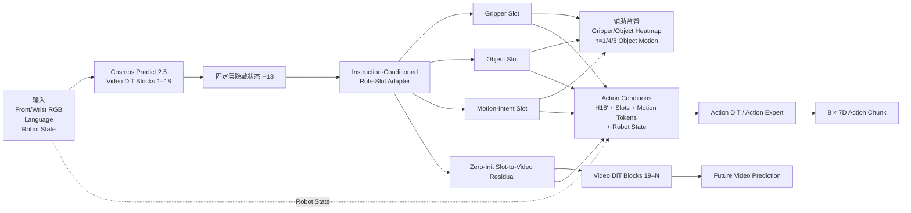

# 基于 Cosmos Predict 2.5 + Action Expert 的任务忠实型 WAM 设计说明

> 当前方案判断、研究故事、结构设计、训练路线与可靠性边界  
> 版本：第一版实现方案（H18 单层接口）  
> 日期：2026-07-27

> 本文档为纯 Markdown 版本，流程图使用 Mermaid 描述；在支持 Mermaid 的编辑器中可直接渲染。
# 摘要与总体判断

> 总体判断：当前实现逻辑是合理的，但应把它定义为“任务忠实型、指令条件化的 Role-Slot Video–Action Bridge”，而不是简单的 heatmap 辅助分支。
> 第一版以 Cosmos Predict 2.5 第 18 个 Transformer block 的 hidden states（H18）为统一接口，从中提取 Gripper、Target Object 和 Motion-Intent 三个结构化 slot。相同 slots 一方面通过零初始化的 residual adapter 反馈到 Video DiT 后续 blocks，影响未来视频生成；另一方面与增强后的 Video hidden、运动方向和 robot state 一同条件化 Action DiT。该方案结构闭环、改动可控、可严格消融，适合作为当前下一步。但其论文创新性仍取决于是否证明：指令变化会改变 slot、未来视频和动作；slot 确实被 Video 与 Action 两条链路使用；收益能在 OOD 和真实视觉中保持。

本方案的核心研究问题不是“能否让模型生成看起来合理的未来视频”，而是“能否让生成式
WAM 对短指令、目标物体和期望运动保持任务忠实性”。现有生成式 Video DiT
可能生成视觉上自然但任务上错误的未来，例如抓错物体、移动方向错误、夹爪与物体错位。新方案试图把这一缺口转化为可学习、可解释和可检验的中间表示。

| **项目**    | **当前定义**                                                                       |
|-------------|------------------------------------------------------------------------------------|
| 主干        | Cosmos Predict 2.5 Video DiT + Action DiT / Action Expert                          |
| 第一版接口  | 第 18 个 Video DiT block 输出 H18；代码索引可能为 blocks\[17\]，必须在运行时确认   |
| 结构化表示  | Gripper Slot、Object Slot、Motion-Intent Slot，建议内部维度 512D                   |
| 辅助监督    | Gripper/Object heatmap；h={1,4,8} 的 object future displacement / direction        |
| Video 路径  | Slots 通过零初始化 gated residual 调制 H18，再进入后续 Video DiT blocks            |
| Action 路径 | 增强后的 H18′ + 3 slots + motion tokens + robot state → Action DiT                 |
| 部署输入    | Front/Wrist RGB（可选 RGB-D）+ language + robot state；仿真 mask/pose 仅作训练监督 |
| 当前不做    | Persistent memory、counterfactual effect、K 候选选择、外部 SAM/Grounding DINO      |

# 1. 当前完整的研究故事

## 1.1 现有 WAM 的核心缺口：视觉合理不等于任务正确

Video generation
的训练目标通常鼓励模型生成视觉分布上自然、连续和合理的未来，但机器人操作要求的是更强的任务条件一致性。一个未来视频即使没有明显视觉伪影，也可能选择了错误的目标物体、采用了错误的运动方向，或者在毫米级接触位置上产生足以导致失败的偏差。

$$\text{Visual plausibility} \neq \text{Task faithfulness}$$

因此，当前方案不把“视频质量”本身作为最终目标，而是将 Video DiT
的中间表征重新组织为与 instruction、gripper、target object 和 object
motion 直接相关的信息，再让这些信息同时约束 future video 与 action
prediction。

## 1.2 为什么从中间 hidden states 提取任务信息

DiT4DiT 已经使用 Video DiT 的固定层 hidden states 作为 Action Expert
的条件，这说明中间层不仅服务于像素生成，也包含可用于控制的预测信息。第一版沿用当前工程接口，从第
18 个 block 输出 H18 开始，不立即修改多层结构；后续再通过 frozen-layer
probe 判断不同角色信息是否更适合从不同深度提取。

> 故事主线
> 现有 WAM：生成“看起来合理”的未来 → 新方案：从 Video DiT 中提取“指令选择的目标物体、夹爪位置和任务期望运动” → 相同结构化表示同时改善 future video 和 action → 将 WAM 从视觉合理性推进到任务忠实性。

## 1.3 为什么第一版不加入 memory 和 effect model

Persistent memory 需要连续 episode loader、跨 replanning 状态维护、reset
和置信度门控，还可能放大一次错误定位。Counterfactual effect
model则需要同状态多动作 branch
数据和额外的动作后果建模。两者都具有价值，但会显著增加变量。第一版先回答更基础的问题：H18
中是否存在可读的 task-role 信息，同一组 slots 是否能同时改善 Video 和
Action。

# 2. 第一版整体架构

*图 1　第一版 Role-Slot Conditioned DiT4DiT 流程框图。相同的 Role Slots 同时参与未来视频生成和动作预测。*

图 1 表示目标结构，而不是单纯的 hidden readout。Role-Slot Adapter
必须位于第 18 个 block 的真实前向路径中：它读取 H18 形成
slots，并返回修改后的 H18′，从而使后续 Video DiT blocks 真正受到 slots
影响。相同 slots 随后也被送入 Action DiT。

$$H_{18}=\operatorname{VideoDiT}_{1:18}(I,L)$$

$$S=\operatorname{RoleSlotAdapter}(H_{18}^{current},L)=[s_{gripper},s_{object},s_{motion}]$$

$$H'_{18}=H_{18}+\alpha\,\operatorname{SlotToVideo}(H_{18},S),\qquad \alpha_0=0$$

$$\hat V_{future}=\operatorname{VideoDiT}_{19:N}(H'_{18})$$

$$\hat A=\operatorname{ActionDiT}(H'_{18},S,\text{MotionTokens},\text{RobotState})$$

# 3. 与当前 DiT4DiT 基线的关系

## 3.1 当前基线

当前主链使用 front+wrist 视觉、语言和 robot state。Cosmos Predict 2.5
产生 fixed-layer predictive hidden，Action DiT 以该 hidden 作为
cross-attention condition，并从 noisy action tokens 生成 8×7D robot-base
metric action chunk。已有 learned tracker 的 object condition 主要通过
state encoder进入 Action DiT，并不显式改变 Video DiT 的未来生成。

Observation + Language  
↓  
Cosmos Predict 2.5 → fixed-layer hidden  
↓  
Action DiT + robot/object state token  
↓  
8 × 7D action chunk

这一结构的主要不足是：Video hidden 是未解释的 dense tokens；Action DiT
需要再次自行寻找目标物体；instruction、target object 和 future
motion之间没有显式对齐；tracker 产生的 object 信息也没有反向约束 Video
generation。

## 3.2 新结构的最小改动

| **模块**    | **第一版改动**                                                    |
|-------------|-------------------------------------------------------------------|
| Video DiT   | 保留 Cosmos Predict 2.5 主体和原 future-video flow-matching 目标  |
| 固定层接口  | 在第 18 个 block 后插入轻量 Role-Slot Adapter                     |
| 结构化信息  | 由 H18 + instruction 提取 3 个 role slots                         |
| Video 反馈  | slot residual 修改 H18，并进入后续 Video blocks                   |
| Action 条件 | 增强 H18′、slots、motion tokens 与 robot state共同驱动 Action DiT |
| 监督边界    | 仿真 mask、pose 和 future object motion只用于监督，不作为部署输入 |

# 4. Role Slots 的含义、维度与交互方式

## 4.1 Slot 是什么

Slot 是一个由网络学习得到的低数量、高维
token，用来聚合某一种任务角色的信息。它不是 mask、bbox 或几何坐标。普通
Video token主要对应某个时间、视角和图像 patch；Role Slot
则对应“夹爪”“指令选择的目标物体”或“物体应如何运动”这一任务语义角色。

$$S\in\mathbb{R}^{B\times3\times D_s},\qquad D_s=512\;\text{（建议值）}$$

| **Slot**           | **语义**                                                                                  | **可解释输出**                                  |
|--------------------|-------------------------------------------------------------------------------------------|-------------------------------------------------|
| Gripper Slot       | 夹爪局部外观、位置、开合线索、运动趋势以及与 object 的接近关系                            | Gripper heatmap                                 |
| Object Slot        | 由 instruction 选择的目标物体，而不是场景中任意显著物体；包含位置、外观、可见性和局部运动 | Object heatmap                                  |
| Motion-Intent Slot | 当前任务阶段下 object 应发生的未来变化；不强制定位不可见的 goal 区域                      | h={1,4,8} 的 3D future displacement / direction |

推荐将 H18 的 2048D tokens投影到 512D slot 空间进行读取和交互，再将
slots投影回 2048D 注入 Video DiT 或拼接到 Action DiT 的 encoder
condition。该维度是工程建议，不是理论限定。

`H18: (B, L, 2048)`  
`Role slots: (B, 3, 512)`  
`Projected slots: (B, 3, 2048)`  
`Motion tokens: (B, 3, 2048)  # h=1/4/8`

## 4.2 Instruction-conditioned slot extraction

三个 slot 不能仅从视觉中形成，否则 Object Slot
可能选择最显著物体而不是指令目标。建议使用两阶段 cross-attention：基础
role query 先读取文本，形成 instruction-conditioned query；随后再从 H18
的当前 observation token 子集中读取视觉信息。

$$q_r=q_r^0+\operatorname{CrossAttn}(q_r^0,E_{language},E_{language})$$

$$s_r=q_r+\operatorname{CrossAttn}(q_r,H_{18}^{current},H_{18}^{current})$$

Motion-Intent Slot 还应在 slots 之间做一次轻量 self-attention，使其综合
gripper、object、instruction 和全局 scene
token，而不是只从单一视觉位置读取。

# 5. 三类可解释输出与监督

## 5.1 Gripper/Object heatmap

Gripper Slot 和 Object Slot 与 H18 的空间 tokens 计算相似度，得到 front
与 wrist 两个视角分别对应的 heatmap。当前 front+wrist
不能被当作一张物理连续的宽屏图像，因此应保留 view boundary 或 view
embedding，并分别监督两个视角。

$$A_r(i)=\operatorname{Softmax}\left(\frac{Q(s_r)K(H_{18,i})^\top}{\sqrt d}\right),\quad r\in\{gripper,object\}$$

训练标签可由 simulator segmentation mask、centroid Gaussian 和
visibility 派生。Heatmap 的作用不仅是可视化，还可以用于对 Video hidden
做 heatmap-weighted pooling，得到更稳定的局部 role feature。

$$z_r=\frac{\sum_iA_r(i)H_i}{\sum_iA_r(i)+\varepsilon}$$

## 5.2 Motion-Intent：为什么不用 goal heatmap

很多 observation 中 goal 可能不在当前视野，强制预测 goal
heatmap会造成错误监督或鼓励模型记忆场景模板。第一版改为预测目标物体在
expert future 中的多时间尺度位移，重点表达“接下来 object
应朝什么方向、移动多远”。

$$v_h=p_{object}(t+h)-p_{object}(t),\qquad h\in\{1,4,8\}$$

主监督建议使用 robot-base frame 的 3D
displacement；在图像上显示时再投影成从 object
heatmap中心出发的二维箭头。需要注意：如果当前视觉、短历史和 instruction
都没有提供 goal 或任务方向信息，任何模型都无法可靠推断 motion
intent。因此数据必须包含足以区分不同方向的 instruction 或场景线索。

# 6. Slots 如何真正参与 Video Generation

如果 slots 只被解码成 heatmap，再送入 Action DiT，它们仍然只是辅助
readout。为了形成共享 Video–Action representation，slots 必须改变 Video
DiT 后续 blocks 的输入。

$$\Delta H_{slot}=\operatorname{CrossAttn}(Q=H_{18},K=P_s(S),V=P_s(S))$$

$$H'_{18}=H_{18}+\alpha\Delta H_{slot}$$

其中 α 为可学习 gate，初始化为 0 或极小值。这样训练初始时模型近似原
Cosmos，避免直接破坏预训练表示；训练过程中只有在 slots 确实有用时，gate
才逐渐增加。

> 实现建议
> 快速 smoke 可使用能够返回修改 output 的 forward hook；正式训练建议将第 18 个 block 包装为 “Original Block 18 → Role-Slot Adapter → Modified Output”。这种 wrapper 更容易管理梯度、两次 Video forward 和不同 cache。

Video 仍应预测完整 future
observation，以保留支撑面、容器、障碍物和相机变化等全局上下文；同时对
gripper/object 区域增加 weighted video
loss。第一版不建议只预测干净前景视频。

$$L_{video}=L_{global-video}+\lambda_{core}L_{gripper/object-region}$$

# 7. Slots 如何参与 Action Prediction

Action DiT 的 robot state 继续使用原 state-token 路径。Video condition
sequence 则在增强后的 H18′ 后追加 slot tokens 和 motion tokens。

encoder_hidden_states = \[H18′, GripperSlot, ObjectSlot, MotionSlot,
Motion_h1, Motion_h4, Motion_h8\]  
hidden_states = \[RobotStateToken, NoisyActionToken_1 ...
NoisyActionToken_8\]  
output = 8 × 7D action chunk

第一版保留完整 H18′可以降低风险，但 Action DiT 可能绕过 slots。必须通过
zero、shuffle、wrong-object 和 wrong-direction 消融证明 slots
被真正使用。后续若需要更严格的 object-centric bottleneck，可将 dense
H18′压缩为少量 global context tokens，再与 slots共同输入 Action DiT。

# 8. 当前 Cosmos/Action 解耦带来的实现约束

当前 DiT4DiT 中，Action DiT 使用的 fixed-layer hidden 与 future-video
flow-matching loss 对应的 hidden来自不同的 Video DiT forward；现有 hook
还可能对 cached hidden执行 detach。因此不能简单地从 cache 中读取
H18、训练 slots，再宣称 slots 改变了视频生成。

| **问题**                                  | **后果**                                                     | **第一版处理**                                                   |
|-------------------------------------------|--------------------------------------------------------------|------------------------------------------------------------------|
| Hidden 被 detach                          | heatmap/action loss 无法更新 Video DiT 或 slot-to-video path | 正式 wrapper 保留计算图；只在明确需要时 detach                   |
| Action forward 与 video-loss forward 分离 | 两个 forward 的 slot cache 容易互相覆盖                      | 使用显式 forward_mode 和独立返回值；adapter 参数共享             |
| Future noise level 不同                   | 若从全部 noisy future tokens读 slot，slot 可能不稳定         | 优先从当前 condition observation token subset提取 slots          |
| 层号可能 off-by-one                       | “第18层”与 Python index不一致                                | 打印注册模块名称和输出 shape，确认实际为 blocks\[17\] 或对应模块 |

# 9. 第一版训练目标

$$L=L_{video}+\lambda_hL_{heatmap}+\lambda_dL_{direction}+\lambda_lL_{language-align}+\lambda_aL_{action}$$

| **Loss**         | **监督**                                                     | **目的**                                 |
|------------------|--------------------------------------------------------------|------------------------------------------|
| L_video          | 原 future-video flow matching + gripper/object 区域加权      | 保证完整世界一致性，同时强化任务核心运动 |
| L_heatmap        | Gripper/Object mask、Gaussian centroid、visibility           | 形成可定位 role slots                    |
| L_direction      | h={1,4,8} future object displacement / direction             | 让 motion slot表达任务阶段相关运动       |
| L_language-align | 正确指令与 slot 对齐；wrong object / opposite direction 对比 | 防止短 instruction 被生成模型忽略        |
| L_action         | Action DiT 原 flow-matching loss                             | 输出 8×7D action chunk                   |

不建议第一轮同时端到端打开所有 loss。应先证明 H18 可解码，再接入
Action，最后开启 slot-to-video residual 和有限的 Video DiT 微调。

# 10. 推荐的分阶段实施路线

**Stage 0：H18 Frozen Probe：**冻结 Cosmos 和 Action DiT，分别训练
gripper/object heatmap probe 与 h=1/4/8 motion probe。回答 H18
是否具有足够的空间定位与未来运动信息。

**Stage 1：Instruction-Conditioned Role-Slot Adapter：**训练 3 个 role
queries、slot adapter、heatmap head、direction head。Video
主干冻结，先验证 slot 语义和 instruction sensitivity。

**Stage 2：Slots → Action DiT：**将 slots 和 motion tokens追加到 Action
DiT condition。先不修改 Video hidden，比较 action error、闭环成功率和
slot 消融。

**Stage 3：Slots → Video DiT：**启用零初始化 slot-to-video
residual，使同一 slots影响后续 Video blocks。优先训练
adapter/LoRA，不直接全参数重训 Cosmos。

**Stage 4：Instruction Stress Test：**同一 observation 下替换 target
object、反转 movement direction、使用 paraphrase，检查 slots、future
video 和 action 是否同步变化。

**Stage 5：Role-Specific Multi-Layer Extraction：**完成 frozen-layer
probe 后，再为 gripper、object、motion
分别选择最合适的层或融合浅/深层。该步骤不是第一版前提。

# 11. 实验矩阵与验收标准

| **ID** | **模型**                           | **回答的问题**                           |
|--------|------------------------------------|------------------------------------------|
| B0     | 原 DiT4DiT / tracker-flat baseline | 当前基线                                 |
| P0     | H18 frozen heatmap + motion probes | H18 是否含可读 task information          |
| S1     | Slots 只接 Action DiT              | 结构化 condition 是否改善动作            |
| S2     | Slots 只调制 Video DiT             | slots 是否改善核心区域 future prediction |
| S3     | Slots 同时服务 Video + Action      | 共享表示是否产生协同收益                 |
| S4     | S3 + instruction alignment         | 是否改善短指令跟随                       |
| S5     | 后续多层 role-specific extraction  | 单层 H18 是否为瓶颈                      |

至少同时报告五类结果：完整视频损失与核心区域损失；heatmap定位；motion
direction/displacement；instruction sensitivity；Action closed-loop
success。只证明 heatmap准确或视频更清晰，不能证明方法对控制有效。

| **维度** | **指标**                                                                                      |
|----------|-----------------------------------------------------------------------------------------------|
| 定位     | centroid pixel error、PCK、mask IoU、visibility F1；front/wrist 分层                          |
| 运动     | 3D displacement error、direction cosine similarity；h=1/4/8 分层                              |
| 语言     | correct / shuffled / wrong-object / opposite-direction instruction 下 slot、video、action变化 |
| 视频     | global video loss、gripper/object region loss、future object motion consistency               |
| 动作     | open-loop action error、closed-loop success、step count、动作稳定性                           |
| 鲁棒性   | texture/light/camera/occlusion/distractor/object geometry OOD；真实 RGB 离线与闭环            |

# 12. 合理性、可靠性与主要风险

> 为什么该方案总体合理
> 它利用当前 DiT4DiT 已存在的 H18 bridge，而不是替换 backbone；结构化监督来自仿真现有 mask/pose/future motion；部署不依赖 privileged label；同一 slots 在 Video 与 Action 两条路径共享；所有新增模块都可以独立开启、关闭和消融。

| **风险**                   | **表现**                                            | **对策**                                                                  |
|----------------------------|-----------------------------------------------------|---------------------------------------------------------------------------|
| H18 空间分辨率不足         | 小物体在 VAE/patch 网格上可能只占极少 token         | 先做 frozen probe；失败时融合较浅层，而不是直接强训                       |
| Language 被忽略            | 单物体、固定任务允许模型只靠场景先验                | 同场景不同 instruction、wrong-object/opposite-direction 训练与测试        |
| Motion intent 成为模板先验 | goal 不可见且语言不提供方向时，模型无法获得真实依据 | 随机化目标方向；明确可部署 goal/task specification；报告信息不足情形      |
| Slots 被 Action 绕过       | 完整 dense H18 可能足以完成动作                     | zero/shuffle/wrong-slot 消融；后续压缩为 global tokens构造更强 bottleneck |
| Slots 未改变 Video         | slot-to-video gate可能长期接近 0                    | 监控 α、residual norm、H18变化和核心区域 video loss                       |
| 破坏预训练 Cosmos          | 中间层注入可能造成训练不稳定                        | zero-init residual、adapter/LoRA、小学习率、baseline-equivalence smoke    |
| 两次 forward cache 混乱    | Action 与 Video loss使用不同 hidden                 | 显式 forward_mode、独立输出、共享 adapter参数，不依赖全局 cache           |
| Sim2Real 边界不完整        | 真实预处理、标定、时延、goal定义仍可能主导失败      | 单独验证真实 perception、相机合同和 robot-base action contract            |

# 13. 创新点与论文叙事边界

仅仅在 H18 后增加 heatmap
head，创新性偏弱。当前方案能够形成更完整贡献的前提是，将其组织为一个
instruction-conditioned、shared Video–Action role
bridge，而不是多个并列辅助 head。

| **方面** | **可形成的贡献**                                                                                                  |
|----------|-------------------------------------------------------------------------------------------------------------------|
| 研究问题 | 生成式 WAM 的 visual plausibility 不保证 task faithfulness，尤其在短指令、目标选择和精确运动方向上                |
| 结构机制 | 从 Video DiT 中间层提取 Gripper/Object/Motion roles，并用同一 slots双向服务 Video generation 与 Action prediction |
| 指令机制 | instruction-conditioned role queries + wrong-instruction stress tests，显式对齐 instruction→object→motion         |
| 仿真优势 | 精确 mask、pose 和 future object motion只作监督，将 simulator privileged decomposition 蒸馏到可部署 RGB 表示      |
| 后续扩展 | 不同 role 从不同层自适应提取；必要时再加入 effect model，而不是第一版堆叠所有模块                                 |

第一版更准确的定位是“Task-Faithful Role-Slot WAM”或“Role-Slot
Conditioned Object-Aware WAM”。在尚未证明 slots
成为不可绕过的信息瓶颈前，不建议直接宣称严格 object-centric；在尚未加入
action-conditioned effect 和同状态多动作监督前，也不应称为 causal WAM。

# 14. 关键 Gate 与停止条件

当前不应立即投入大规模全参数训练。以下 Gate 依次决定方案是否值得继续：

1.  H18 frozen probe 能否稳定定位 gripper/object，并预测 future object
    motion？

2.  同一 observation 下改变 instruction，Object/Motion slots
    是否按语义发生正确变化？

3.  Slots 接入 Action DiT 后，zero/shuffle/wrong-slot 是否显著降低表现？

4.  Slot-to-video residual 是否真实改变核心区域 future
    prediction，而不是 gate 永远为零？

5.  ID 收益是否能迁移到遮挡、distractor、视觉 OOD 和真实图像？

若 H18 probe 本身失败，应优先改用浅层或多层融合；若 instruction stress
test失败，应先修改数据而不是增加网络；若 slots准确但 Action
不使用，应重新设计 bottleneck；若收益仅存在于 simulator
privileged/oracle 条件，则不能支撑 Sim2Real 主张。

# 15. 最终建议

> 建议冻结的第一版定义
> Observation + instruction → Cosmos blocks 1–18 → instruction-conditioned Gripper/Object/Motion slots → Gripper/Object heatmap + h=1/4/8 object motion → zero-init slot-to-video residual → Cosmos late blocks预测完整 future video；相同 H18′、slots、motion tokens 与 robot state 条件化 Action DiT，输出 8×7D action chunk。

这套逻辑在科学上是自洽的：它针对生成式 WAM
“视觉上合理但任务上不够准确”的缺口；在工程上也可分阶段实现，保留原
DiT4DiT 主体并提供清晰消融。第一版最大的价值不是证明 slots
这一名词本身，而是验证一条完整因果链之外的基础链路：instruction
是否选择正确 object，结构化 roles 是否改善 future prediction，以及同一
roles 是否进一步改善 action。

后续只有在第一版 Gate 成立后，才建议推进 role-specific multi-layer
extraction；只有在需要更强动作后果建模时，再增加 counterfactual
effect。这样能够避免架构堆叠，同时保留清晰的论文升级路线。

# 附录：当前设计依据文档

\[1\] OBJECT_CENTRIC_WAM_THREE_FEASIBLE_DESIGNS_CN_20260724.md

\[2\]
OBJECT_CENTRIC_WAM_DESIGN_REASSESSMENT_AND_RECOMMENDATION_CN_20260724.md

\[3\] MANISKILL_OBJECT_CENTRIC_DATA_AND_TRACKER_CN.md

\[4\]
MANISKILL_EORT_V3_COLLECTION_AND_TRACKER_IMPLEMENTATION_CN_20260721.md
